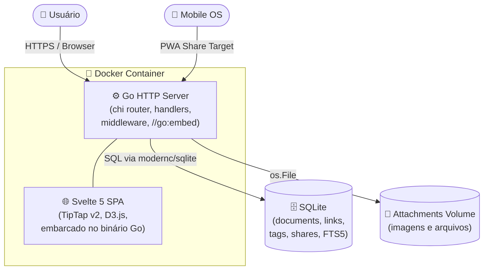

# PKD — Personal Knowledge Database

Base de conhecimento pessoal auto-hospedada. Segunda versão (PKM Refactor): links bidirecionais, grafo de conhecimento, captura de conteúdo externo, interface Svelte moderna.

**Imagem:** `ghcr.io/edalcin/pkd:latest` · **Stack:** Go 1.25 + Svelte 5 + SQLite · **Tamanho:** ~22 MB

---

## Funcionalidades

| | |
|---|---|
| 📁 **Hierarquia ilimitada** | Documentos dentro de documentos, arrastar e soltar para reorganizar |
| ✏️ **Editor rico** | TipTap v2 — formatação, imagens inline redimensionáveis, tabelas, blocos de código |
| 🔗 **Links bidirecionais** | Digite `[[nome]]` para criar links; backlinks aparecem automaticamente em "Referenciado por" |
| 🕸️ **Graph View** | Visualização D3.js force-directed de toda a rede de documentos e conexões |
| 📡 **Captura externa** | Envie links e textos de outros apps via PWA share target (`POST /api/capture` + Open Graph) |
| 🏷️ **Hashtags** | Marque documentos com `#tags` e filtre a árvore por uma ou mais tags (AND) |
| 🔍 **Super-busca** | Busca por substring em título, corpo e tags (SQLite FTS5) com snippets |
| 📅 **Calendário** | Navegue pelos documentos pela data de criação |
| 📎 **Anexos** | Arquivos ficam em volume externo ao container, sobrevivem a atualizações |
| 🔗 **Links públicos** | Links de compartilhamento revogáveis, somente leitura |
| 🛡️ **Administração** | Backup/restore, limpeza de órfãos, renomear/mesclar tags, lixeira |
| 🌙 **Tema claro/escuro** | Alternância persistida no `localStorage` |
| 📱 **Mobile-first** | Layout responsivo, alvos de toque ≥ 44 px |
| 📲 **PWA** | Instalável como app; modo offline somente leitura; share target no celular |

---

## Início rápido

```bash
mkdir -p /caminho/pkd/db /caminho/pkd/attachments

docker run -d \
  --name pkd \
  --restart unless-stopped \
  -p 8080:8080 \
  -v /caminho/pkd/db:/data/db \
  -v /caminho/pkd/attachments:/data/attachments \
  -e PKD_PASSWORD='SUBSTITUA_POR_UMA_SENHA_FORTE' \
  -e PKD_DB_PATH=/data/db/pkd.sqlite \
  -e PKD_ATTACHMENTS_PATH=/data/attachments \
  ghcr.io/edalcin/pkd:latest
```

Acesse `http://localhost:8080` e digite a senha mestra.

---

## Instalação no UNRAID

Guia completo em português (sem terminal): **[UNRAID.md](UNRAID.md)**

---

## docker compose

```yaml
services:
  pkd:
    image: ghcr.io/edalcin/pkd:latest
    container_name: pkd
    restart: unless-stopped
    ports:
      - "8080:8080"
    environment:
      PKD_PASSWORD: ${PKD_PASSWORD:?PKD_PASSWORD is required}
      PKD_DB_PATH: /data/db/pkd.sqlite
      PKD_ATTACHMENTS_PATH: /data/attachments
    volumes:
      - ./data/db:/data/db
      - ./data/attachments:/data/attachments
    healthcheck:
      test: ["/pkd", "-healthcheck"]
      interval: 30s
      timeout: 3s
      retries: 3
```

```bash
export PKD_PASSWORD='SUBSTITUA_POR_UMA_SENHA_FORTE'
docker compose up -d
```

---

## Variáveis de ambiente

| Variável | Obrigatória | Padrão | Descrição |
|---|---|---|---|
| `PKD_PASSWORD` | **sim** | — | Senha mestra (nunca armazenada, apenas comparada na memória) |
| `PKD_DB_PATH` | **sim** | — | Caminho do arquivo SQLite dentro do container |
| `PKD_ATTACHMENTS_PATH` | **sim** | — | Caminho do diretório de anexos dentro do container |
| `PKD_LISTEN_ADDR` | não | `:8080` | Endereço de escuta HTTP |
| `PKD_SESSION_IDLE_MINUTES` | não | `60` | Minutos de inatividade até expirar a sessão |
| `PKD_MAX_IMAGE_MB` | não | `10` | Tamanho máximo de imagem inline (MB) |
| `PKD_MAX_ATTACHMENT_MB` | não | `100` | Tamanho máximo de arquivo anexado (MB) |
| `PKD_TRUST_PROXY_HEADERS` | não | `0` | Defina como `1` apenas atrás de proxy reverso confiável |
| `PKD_BASE_URL` | não | *(host da request)* | URL pública base para links de compartilhamento (ex: `https://pkd.dalc.in/`) |

---

## Links bidirecionais

No editor TipTap, digite `[[` para abrir o autocomplete de documentos. Selecione o alvo — um link é criado com o ID do documento. O documento alvo mostra automaticamente "Referenciado por" na seção de backlinks.

Os links são sincronizados na mesma transação que o save do documento (atomicidade garantida).

---

## Graph View

Acesse pelo ícone 🕸️ na barra superior. O grafo mostra documentos como nós (coloridos pela tag primária) e links como arestas. Apenas documentos conectados aparecem por padrão (toggle para mostrar todos). Interação: scroll para zoom, arrastar para pan, clicar em nó abre o documento.

---

## Captura de conteúdo externo

**No celular (PWA):** Compartilhe um link, texto ou imagem de qualquer app → selecione PKD no menu de compartilhamento do SO → novo documento criado com tag `#captura` e metadados Open Graph extraídos da URL.

**Via API:**
```bash
curl -X POST http://localhost:8080/api/capture \
  -H "Content-Type: application/json" \
  -H "X-CSRF-Token: <token>" \
  -b "pkd_session=<session>; pkd_csrf=<csrf>" \
  -d '{"title": "Artigo interessante", "url": "https://example.com", "tags": ["leitura"]}'
```

---

## Proxy reverso (HTTPS)

O PKD não gerencia TLS — encerre no proxy reverso. Exemplo com **Caddy**:

```caddy
pkd.exemplo.lan {
    reverse_proxy localhost:8080
}
```

Ao usar proxy reverso, adicione `PKD_TRUST_PROXY_HEADERS=1`.

---

## Compilar a partir do código-fonte

Requer **Go 1.25+** e **Node.js 22+**.

```bash
git clone https://github.com/edalcin/pkd.git
cd pkd

# 1. Build do frontend Svelte
cd frontend && npm install && npm run build && cd ..

# 2. Testes e servidor de desenvolvimento Go
go test ./...
PKD_PASSWORD=devpassword \
PKD_DB_PATH=/tmp/pkd.sqlite \
PKD_ATTACHMENTS_PATH=/tmp/pkd-att \
go run ./cmd/pkd
```

---

## Documentação

| Documento | Idioma | Descrição |
|---|---|---|
| [UNRAID.md](UNRAID.md) | 🇧🇷 PT-BR | Instalação no UNRAID via GUI |
| [docs/c4/context.md](docs/c4/context.md) | 🇺🇸 EN | C4 Level 1 — Contexto do sistema |
| [docs/c4/container.md](docs/c4/container.md) | 🇺🇸 EN | C4 Level 2 — Containers |
| [docs/c4/component.md](docs/c4/component.md) | 🇺🇸 EN | C4 Level 3 — Componentes Go |
| [docs/c4/code.md](docs/c4/code.md) | 🇺🇸 EN | C4 Level 4 — Structs e fluxos de código |
| [docs/security.md](docs/security.md) | 🇺🇸 EN | Referência de segurança |
| [docs/operations.md](docs/operations.md) | 🇺🇸 EN | Guia de operações e backup |
| [specs/003-pkm-refactor/quickstart.md](specs/003-pkm-refactor/quickstart.md) | 🇺🇸 EN | Quickstart detalhado v2 |

---

## Arquitetura (resumo C4)



> Diagramas completos em [docs/c4/](docs/c4/).

---

## Licença

MIT © 2026 Eduardo Dalcin
