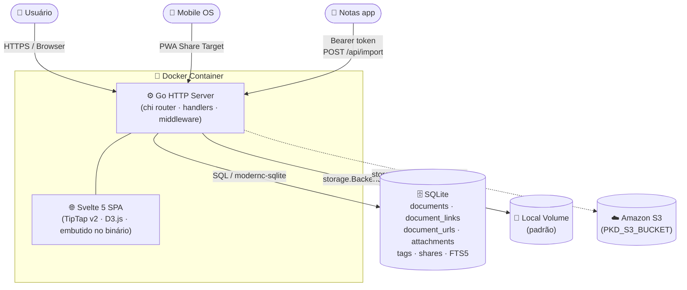

<div align="center">
  
  <h1>PKD — Personal Knowledge Database</h1>
  <p>Base de conhecimento pessoal auto-hospedada, focada em organização, conexões e recuperação rápida de informações.</p>

  <p>
    
    
    
    
    
  </p>
</div>

---

## Funcionalidades

### Conteúdo e edição

| | |
|---|---|
| 📁 **Hierarquia ilimitada** | Documentos dentro de documentos, arrastar e soltar para reorganizar |
| ✏️ **Editor rico** | TipTap v2 — negrito, itálico, títulos, listas, código, citações, imagens inline |
| 📐 **Barra de ferramentas completa** | Tabelas, imagem por URL, alinhamento de parágrafo, destaque de texto com cor personalizável |
| 🖼️ **Redimensionamento de imagens** | Passe o mouse sobre uma imagem e arraste a alça (canto inferior direito) para redimensioná-la; largura persiste no documento |
| ⬇️ **Exportar como Markdown** | Botão `⬇ .md` no toolbar converte o documento para Markdown e baixa o arquivo `.md` no browser |
| 🎯 **Modo foco** | Botão de tela cheia abre o editor em uma janela separada, sem distrações; estado de conteúdo sincronizado ao fechar |
| 🔗 **Notas relacionadas** | Relacione documentos pelo painel "Notas relacionadas"; as relações são **simétricas** — ambos os documentos exibem a mesma lista de relacionados, sem distinção de direção |
| 🔗 **Links inline no editor** | Digite `[` no editor para abrir autocomplete de documentos internos; selecione para inserir um chip de link clicável diretamente no texto |
| 🔒 **Títulos únicos** | Títulos funcionam como identificadores de documentos — duplicatas são bloqueadas com diálogo informativo e botão para navegar ao documento existente |
| 📍 **Breadcrumb de hierarquia** | Ancestrais clicáveis exibidos abaixo do título no editor — navegue para qualquer nível da hierarquia com um clique |
| 📡 **Captura externa** | Envie links de outros apps via PWA share target; Open Graph extraído automaticamente |
| 🔍 **Busca FTS5** | Busca em título, corpo e tags com SQLite Full-Text Search, suporte a snippets |
| 📅 **Calendário** | Navegue pelos documentos pela data de criação |
| 🕰️ **Histórico de versões** | Snapshot automático a cada save com dedup SHA-256 (saves idênticos não geram versão). Visualize, compare e restaure qualquer versão anterior via botão `⏱` na barra do documento. Retenção configurável (padrão 50 versões/documento) |
| ⭐ **Favoritar da barra** | Botão ⭐ na barra de ações do documento — alterna favorito sem precisar ir à sidebar |

### Árvore lateral

| | |
|---|---|
| 🔎 **Filtro unificado** | Campo de busca na sidebar filtra a árvore em tempo real por título; pesquisa e navegação integradas em um único controle |
| 🎨 **Ícones Boxicons** | Cada documento tem um ícone Boxicons selecionável; pasta ganha ícone de pasta automaticamente ao receber filhos; folha volta ao ícone padrão ao ficar sem filhos |
| 🗂️ **Estado persistido** | Nós expandidos e colapsados na árvore são lembrados entre sessões |

### Associações por documento

Cada documento possui uma **área de associações** no rodapé, com três colunas:

| Coluna | Funcionalidade |
|---|---|
| 📄 **Notas relacionadas** | Relacione documentos com busca autocomplete; relações simétricas — ambos os documentos exibem a mesma lista |
| 📎 **Arquivos** | Imagens mostram thumbnail; PDFs, áudios e outros tipos exibem ícone. Clicar abre modal de visualização (lightbox, embed PDF, player de áudio/vídeo) |
| 🔗 **Links externos** | URLs com título opcional; verificação de validade no painel de administração |

### Sub-documentos

Quando um documento possui filhos diretos na hierarquia, eles são exibidos como **cards clicáveis** logo abaixo do conteúdo principal, antes da área de associações. Cada card mostra o ícone, o título e um preview do texto (até 160 caracteres). Clicar em um card navega diretamente para o sub-documento.

### Organização e visualização

| | |
|---|---|
| 🏷️ **Hashtags com autocomplete** | Marque documentos com tags; ao digitar, sugeridas as tags já existentes no sistema |
| 🎨 **Cores por tag** | Cada tag possui cor configurável; chips coloridos em toda a interface (sidebar e editor) |
| 🗂️ **Arquivamento** | Arquive documentos pelo ícone na barra; arquivar pai cascateia para todos os filhos recursivamente. Documentos arquivados são auto-trancados; desarquivar pai libera todos os filhos |
| 🕸️ **Graph View** | Grafo D3.js force-directed: nós de documentos, tags e hierarquia pai/filho. Toggle **Semântico** exibe arestas de similaridade de conteúdo (embeddings Gemini, roxo tracejado). Toggles independentes para todos os tipos; filtro de nós por tipo de relação |
| 🔗 **Links públicos** | Links de compartilhamento revogáveis, somente leitura |

### Administração

| | |
|---|---|
| 💾 **Backup / Restore do banco** | Download do SQLite + restore com confirmação |
| 📦 **Backup / Restauração de anexos** | Backend local: ZIP síncrono. Backend S3: backup **assíncrono** que monta o ZIP no próprio bucket (sem usar disco da instância) e oferece URL pré-assinada (TTL 15 min). Restauração **cross-backend**: ZIP gerado em S3 pode ser restaurado em backend local e vice-versa. Manifesto interno usa SHA256 (dedup natural + verificação de integridade). Job tracking com progresso e contadores (gravados / mantidos / órfãos / hash inválido). |
| 🗑️ **Lixeira** | Documentos excluídos ficam em lixeira; restauráveis individualmente ou em lote |
| 🏷️ **Tags** | Renomear, editar cor, excluir ou mesclar tags globalmente; botão para remover tags órfãs |
| 📎 **Arquivos** | Grade com todos os anexos do sistema (thumbnail para imagens); botão "Verificar Órfãos" lista arquivos sem documento associado; seção "Imagens externas" lista documentos com imagens hospedadas fora do PKD e permite importá-las individualmente com um clique |
| 🔗 **Links externos** | Tabela de gerenciamento de todos os links externos; testa validade (HTTP HEAD) e permite excluir inválidos em lote |
| ☁️ **Armazenamento** | Migração de anexos entre armazenamento local e Amazon S3; teste de conexão, migração SHA256-verificada com progresso em tempo real; reconciliação S3↔DB e LOCAL↔DB (corrige `storage_location` sem mover arquivos); limpeza da origem com verificação de cópia no destino antes de apagar; backup/restauração assíncrona com streaming multipart e URL pré-assinada |
| 🧹 **Limpeza** | Executa `VACUUM` no banco de dados para recuperar espaço em disco |
| ⚙️ **Configurações** | Retenção de versões configurável (padrão 50/documento); painel de status dos embeddings semânticos: modelo, intervalo de varredura, chave configurada e contagem de vetores em cache |

### Interface

| | |
|---|---|
| 🌙 **Tema claro / escuro** | Alternância persistida no `localStorage` |
| 📱 **Mobile master-detail** | Em telas ≤ 640px: tela-lista (topbar 2 linhas, busca larga, árvore inteira) e tela-detalhe (botão ← para voltar). Sem drawer hambúrguer. Desktop (≥ 641px) inalterado |
| 📲 **PWA** | Instalável como app; share target no celular; offline somente leitura |
| ↩️ **Histórico de navegação** | Botões ← / → na barra superior (desktop) e atalhos Alt+← / Alt+→ navegam pelo histórico de documentos visitados na sessão |
| 🔄 **Sessão persistente** | Login lembrado por até 30 dias de inatividade; último documento aberto restaurado automaticamente ao retornar à ferramenta |

### Integração com Notas

O PKD expõe um endpoint de importação para receber notas do app [Notas](https://github.com/edalcin/notas):

- **Endpoint**: `POST /api/import` — autenticado via Bearer token (sem necessidade de sessão de login)
- **O que faz**: cria um documento com o título, conteúdo HTML e tags da nota de origem; aplica automaticamente a tag `notas` para identificar a procedência
- **Ativação**: defina `PKD_IMPORT_TOKEN` no container (ver [Variáveis de ambiente](#variáveis-de-ambiente)); o endpoint é desativado quando a variável está ausente

---

## Início rápido

```bash
mkdir -p /caminho/pkd/db /caminho/pkd/attachments

docker run -d \
  --name pkd \
  --restart unless-stopped \
  -p 8080:8080 \
  -v /caminho/pkd/db:/data/db \
  -v /caminho/pkd/attachments:/data/attachments \
  -e PKD_PASSWORD='SUBSTITUA_POR_UMA_SENHA_FORTE' \
  -e PKD_DB_PATH=/data/db/pkd.sqlite \
  -e PKD_ATTACHMENTS_PATH=/data/attachments \
  ghcr.io/edalcin/pkd:latest
```

Acesse `http://localhost:8080` e digite a senha mestra.

---

## Instalação no UNRAID

Guia completo em português (sem terminal): **[UNRAID.md](UNRAID.md)**

---

## docker compose

```yaml
services:
  pkd:
    image: ghcr.io/edalcin/pkd:latest
    container_name: pkd
    restart: unless-stopped
    ports:
      - "8080:8080"
    environment:
      PKD_PASSWORD: ${PKD_PASSWORD:?PKD_PASSWORD is required}
      PKD_DB_PATH: /data/db/pkd.sqlite
      PKD_ATTACHMENTS_PATH: /data/attachments
      # Opcional: ativa importação de notas externas (ex: app Notas)
      PKD_IMPORT_TOKEN: ${PKD_IMPORT_TOKEN}
    volumes:
      - ./data/db:/data/db
      - ./data/attachments:/data/attachments
    healthcheck:
      test: ["/pkd", "-healthcheck"]
      interval: 30s
      timeout: 3s
      retries: 3
```

```bash
# .env — nunca versione este arquivo
PKD_PASSWORD=senha-forte-aqui
PKD_IMPORT_TOKEN=token-secreto-compartilhado-com-notas  # opcional
```

---

## Variáveis de ambiente

| Variável | Obrigatória | Padrão | Descrição |
|---|---|---|---|
| `PKD_PASSWORD` | **sim** | — | Senha mestra (nunca armazenada, comparada apenas em memória) |
| `PKD_DB_PATH` | **sim** | — | Caminho do arquivo SQLite dentro do container |
| `PKD_ATTACHMENTS_PATH` | **sim** | — | Caminho do diretório de anexos dentro do container |
| `PKD_LISTEN_ADDR` | não | `:8080` | Endereço de escuta HTTP |
| `PKD_SESSION_IDLE_MINUTES` | não | `43200` | Minutos de inatividade até expirar a sessão (padrão ≈ 30 dias) |
| `PKD_MAX_IMAGE_MB` | não | `10` | Tamanho máximo de imagem inline (MB) |
| `PKD_MAX_ATTACHMENT_MB` | não | `100` | Tamanho máximo de arquivo anexado (MB) |
| `PKD_TRUST_PROXY_HEADERS` | não | `0` | Defina como `1` apenas atrás de proxy reverso confiável |
| `PKD_BASE_URL` | não | *(host da request)* | URL pública base para links de compartilhamento (ex: `https://pkd.exemplo.com/`) |
| `PKD_IMPORT_TOKEN` | não | *(desativado)* | Token secreto para o endpoint `POST /api/import`. Se vazio, o endpoint não existe. Gere com `openssl rand -hex 32` |
| `PKD_S3_BUCKET` | não | *(vazio)* | Nome do bucket S3; junto com `PKD_S3_REGION` habilita S3 como backend disponível |
| `PKD_S3_REGION` | não | *(vazio)* | Região AWS do bucket (ex: `us-east-1`) |
| `PKD_S3_PREFIX` | não | *(vazio)* | Prefixo de caminho dentro do bucket (ex: `pkd/attachments/`) |
| `PKD_S3_ACCESS_KEY_ID` | não | *(credenciais da instância)* | Access Key ID; se vazio, usa credenciais padrão da instância/IAM role |
| `PKD_S3_SECRET_ACCESS_KEY` | não | *(credenciais da instância)* | Secret Access Key correspondente |
| `GEMINI_API_KEY` | não | *(desativado)* | Chave de API Google Gemini para embeddings semânticos. Sem ela o toggle **Semântico** no Graph View fica indisponível e o worker de embedding não roda |
| `PKD_EMBED_MODEL` | não | `models/gemini-embedding-001` | Modelo Gemini para geração de embeddings. Alterar o modelo invalida todos os embeddings em cache (re-embed automático na próxima varredura) |
| `PKD_EMBED_SWEEP_MINUTES` | não | `15` | Cadência do worker de embedding em background (minutos). O worker também dispara imediatamente ao criar/editar documentos |

---

## Como usar

### Notas relacionadas

Use o campo **"Buscar nota para relacionar…"** na coluna _Notas relacionadas_ no rodapé do documento para criar relações entre documentos. As relações são **simétricas** — ambos os documentos exibem a mesma lista de relacionados. Para remover um vínculo, clique no ✕ ao lado do documento em qualquer um dos lados.

### Tags e cores

Digite no campo `+ tag` no cabeçalho do documento. Ao digitar, um dropdown sugere as tags já existentes no sistema — selecione ou continue digitando para criar uma nova. Confirme com `Enter` ou `,`.

Para personalizar a cor de uma tag, acesse **Administração → Tags**, clique no seletor de cor ao lado da tag desejada e confirme. A cor propaga imediatamente para os chips de tag na sidebar e no editor.

### Ícones dos documentos

Cada documento na árvore lateral possui um ícone [Boxicons](https://boxicons.com/) selecionável. Clique no ícone ao lado do título para abrir o seletor — há busca dinâmica por nome. Documentos com filhos ganham automaticamente um ícone de pasta; ao perder todos os filhos, voltam ao ícone padrão.

### Modo foco

Clique no botão de modo foco (⛶) na barra de ferramentas. O editor abre em uma janela separada sem sidebar, tags ou cabeçalho — apenas o conteúdo. Ao fechar a janela, o conteúdo editado é sincronizado de volta ao documento principal.

### Sub-documentos

Crie documentos filhos normalmente pela sidebar (clique direito → "Novo sub-documento"). Ao abrir o documento pai, os filhos diretos aparecem automaticamente como cards logo abaixo do conteúdo, com preview do texto. Clicar em um card navega para o sub-documento.

### Anexos e visualização

Arraste um arquivo ou clique em **"+ Anexar arquivo"**. Imagens exibem thumbnail diretamente; clicar em qualquer anexo abre um modal:

- **Imagem** → lightbox com zoom nativo do browser
- **PDF** → visualizador embutido
- **Áudio** → player HTML5
- **Vídeo** → player HTML5
- **Outros** → tela de download

### Redimensionar imagens

Insira uma imagem no editor (upload, URL ou colar). Passe o mouse sobre ela — uma alça azul aparece no canto inferior direito. Clique e arraste horizontalmente para ajustar a largura. Ao soltar, a nova largura é salva no documento automaticamente.

### Histórico de versões

Clique no botão `⏱` na barra de ações do documento. O dialog de histórico exibe todas as versões salvas com data/hora e preview do conteúdo.

- **Restaurar** — clique em "Restaurar esta versão" para reverter o documento ao snapshot selecionado. A restauração reutiliza o fluxo normal de save (incluindo bloqueio otimista e sincronia de links).
- **Excluir versão** — passe o mouse sobre uma versão para revelar o ícone de lixeira; confirme para excluí-la individualmente.
- **Configurar retenção** — em **Administração → Configurações**, ajuste o campo "Máx. versões por documento" (padrão 50, aceita 1–10000).

Saves idênticos não geram versão nova (dedup por SHA-256 do conteúdo).

### Arquivamento

Clique no ícone de caixa (📦) na barra superior do editor para arquivar ou desarquivar um documento. Ao arquivar:

- O documento e **todos os seus filhos** são arquivados recursivamente e trancados automaticamente
- Documentos arquivados somem da árvore principal e aparecem na view **Arquivados**
- Um documento arquivado pode ser editado se destrancado individualmente

Ao desarquivar o documento pai, **todos os filhos** são desarquivados em cascata e ficam novamente disponíveis na árvore principal.

### Armazenamento S3

Configure as variáveis `PKD_S3_BUCKET` e `PKD_S3_REGION` para habilitar o backend S3. Depois acesse **Administração → Storage**:

1. **Testar conexão** — verifica credenciais e acesso ao bucket
2. **Migrar para backend ativo** — copia todos os anexos do backend de origem para o ativo com verificação SHA256 por arquivo; exibe barra de progresso em tempo real e relatório final; idempotente (pode ser repetido após falha)
3. **Ativar S3** — troca o backend ativo; novos uploads vão para o S3
4. **Reconciliar S3 ↔ DB** — corrige `storage_location` no banco quando ele diverge do que existe no bucket (ex: após restore do DB); não move arquivos
5. **Reconciliar LOCAL ↔ DB** — mesmo que acima, para o backend local; sempre visível mesmo sem S3
6. **Limpar origem** — remove arquivos do backend anterior; **verifica** que existe cópia confirmada no backend ativo antes de cada exclusão; arquivos sem cópia são ignorados e reportados

Todas as operações (Migrar, Reconciliar, Limpar) são **assíncronas** com job tracking: barra de progresso durante execução e relatório detalhado ao concluir. Somente uma operação por backend por vez (segunda tentativa retorna 409).

Fluxo completo Local → S3:
```
Testar conexão → Migrar → Ativar S3 → Limpar origem (verificar ignorados = 0)
```

### Backup e restauração de anexos (S3)

Quando o backend ativo é S3, o PKD oferece backup/restauração assíncrona **sem materializar o ZIP no disco da instância de aplicação**:

1. **Backup assíncrono** — `Administração → Storage → Backup assíncrono (S3)`. Pipeline `archive/zip → io.Pipe → manager.Uploader` grava o ZIP diretamente no bucket em `<prefix>/_backup-tmp/<job-id>.zip`. Retorna URL pré-assinada (TTL 15 min) para download direto S3 → navegador. Progresso e contadores via polling.
2. **Restauração assíncrona** — `Administração → Storage → Restauração assíncrona` aceita ZIP gerado pela aplicação. Restauração **cross-backend** (ZIP de prod S3 restaurado em dev local e vice-versa) e **in-place** (mesmo backend, recupera arquivos perdidos). 3 modos de conflito: `sobrescrever` (padrão), `manter existente`, `abortar`.
3. **Manifesto interno** (`manifest.json` como última entrada do ZIP) — mapeia SHA256 → `stored_filename`s. Dedup natural quando múltiplas linhas de `attachments` compartilham o mesmo conteúdo; fan-out automático no restore.
4. **Integridade** — cada entrada restaurada tem hash verificado antes de gravar. Hash mismatch é relatado por arquivo sem abortar a operação (FR-008). Entradas órfãs (SHA256 sem linha em `attachments`) são ignoradas e listadas no resultado.
5. **Limpeza automática** — no startup, sweep não-bloqueante remove objetos em `_backup-tmp/` com idade > 24h (recuperação de crashes).
6. **Concorrência** — uma operação ativa por backend por vez; segunda requisição retorna 409.

**IAM mínimo**: `s3:GetObject`, `s3:PutObject`, `s3:DeleteObject`, `s3:ListBucket`, `s3:DeleteObjects`, `s3:AbortMultipartUpload`.

Endpoints legados (`/api/admin/storage/backup-attachments` síncrono local) continuam funcionando.

Detalhes operacionais em [`docs/operations.md`](docs/operations.md).

### Importar imagens externas

Ao colar conteúdo de outra página (blog, artigo, e-mail), imagens com URL externa ficam referenciadas no documento mas não são armazenadas no PKD — podem quebrar se o site original sair do ar.

**No editor** — quando o documento aberto contém imagens externas, um botão `🌐⬇` aparece na barra de ferramentas. O botão fica desabilitado durante a importação (evita duplo-clique) e desaparece imediatamente ao concluir quando não restam mais imagens externas. Um feedback inline exibe quantas foram importadas e quantas falharam (visível por 5 segundos).

**Em lote via Administração → Arquivos** — a seção "Imagens externas" lista todos os documentos com imagens externas, com o número de imagens por documento. Clique em "🌐⬇ Importar" ao lado de cada documento para importar individualmente. Se o documento importado estiver aberto no editor, o conteúdo é atualizado automaticamente sem necessidade de recarregar a página.

As imagens importadas passam a aparecer na grade de "Arquivos anexados" e ficam disponíveis mesmo se o site externo for removido.

### Exportar como Markdown

Clique no botão **⬇ .md** na barra de ferramentas. O browser baixa imediatamente o arquivo `<título>.md` com o conteúdo do documento convertido para Markdown (headings `#`, código em triple-backtick, links `[Documento]` preservados).

### Links inline no editor

Digite `[` em qualquer posição do editor. Um dropdown de autocomplete aparece buscando documentos pelo título em tempo real (FTS5). Continue digitando para filtrar os resultados; use ↑/↓ para navegar, `Enter` ou clique para confirmar.

Ao selecionar, o texto digitado é substituído por um **chip de link** clicável com o título do documento. Clicar no chip navega para o documento vinculado. Os links são bidirecionais — ambos os documentos exibem a relação no painel "Notas relacionadas" e no Graph View (aresta de tipo _link_).

No export Markdown (botão `⬇ .md`), chips de link são convertidos para `[Título do Documento]`.

---

### Graph View

Acesse pelo ícone 🕸️ na barra superior. O grafo mostra:

- **Nós de documento** → círculos coloridos pela tag primária
- **Nós de tag** → círculos com borda tracejada rosa
- **Arestas de hierarquia** → linhas tracejadas `--accent` entre pai e filho
- **Arestas de link** → relações manuais entre documentos (azul)
- **Arestas de tag** → relação documento ↔ tag (rosa)
- **Arestas semânticas** → similaridade de conteúdo via Gemini embeddings (roxo tracejado); visíveis quando `GEMINI_API_KEY` está configurada

O campo de **filtro da barra superior** também atua no grafo — ao digitar, apenas os nós que correspondem ao filtro são exibidos, mantendo as arestas de seus vizinhos diretos para preservar o contexto.

**Toggles de visibilidade** (independentes, sem reiniciar simulação):

| Toggle | O que controla |
|---|---|
| **Hierarquia** | Exibe/oculta arestas e nós de relação pai/filho |
| **Links entre docs** | Exibe/oculta arestas e nós de relação manual entre documentos |
| **Relações com tags** | Exibe/oculta arestas e nós de tag |
| **Semântico** | Exibe/oculta arestas de similaridade semântica (requer `GEMINI_API_KEY`) |
| **Todos os docs** | Força exibição de todos os documentos, mesmo sem conexões |

Clicar em um nó de tag filtra o grafo por aquela tag. Clicar em um nó de documento navega para o documento.

**Embeddings semânticos** são gerados proativamente em background: no startup do servidor, ao criar/editar documentos e a cada `PKD_EMBED_SWEEP_MINUTES` minutos. Os vetores ficam armazenados no próprio SQLite — o grafo semântico carrega instantaneamente sem nova chamada à API no momento do clique no toggle.

---

## Proxy reverso (HTTPS)

O PKD não gerencia TLS — encerre no proxy reverso. Exemplo com **Caddy**:

```caddy
pkd.exemplo.lan {
    reverse_proxy localhost:8080
}
```

Ao usar proxy reverso, adicione `PKD_TRUST_PROXY_HEADERS=1` e configure `PKD_BASE_URL` com a URL pública para que os links de compartilhamento gerem URLs corretas.

---

## Compilar a partir do código-fonte

Requer **Go 1.25+** e **Node.js 22+**.

```bash
git clone https://github.com/edalcin/pkd.git
cd pkd

# 1. Build do frontend Svelte
cd frontend && npm install && npm run build && cd ..

# 2. Rodar localmente
PKD_PASSWORD=devpassword \
PKD_DB_PATH=/tmp/pkd.sqlite \
PKD_ATTACHMENTS_PATH=/tmp/pkd-att \
go run ./cmd/pkd
```

---

## CI/CD

Todo push para o branch `main` dispara o workflow do GitHub Actions que:
1. Executa `go test ./...`
2. Builda a imagem Docker (linux/amd64)
3. Publica `ghcr.io/edalcin/pkd:edge` (UNRAID/dev — atualiza automaticamente) e `ghcr.io/edalcin/pkd:sha-<hash>` (imutável)

**Promoção para produção** — execute manualmente o workflow `promote-to-prod` (via `workflow_dispatch` no GitHub Actions) ou crie uma tag semântica:

```bash
git tag -a v1.2.3 -m "descrição" && git push origin v1.2.3
```

O workflow re-etiqueta a imagem `:edge` como `:stable` e `:v1.2.3` — sem rebuild.

**Limpeza automática** — workflow semanal remove tags `sha-*` com mais de 30 dias do GHCR.

Nenhuma credencial é armazenada no repositório — o workflow usa o `GITHUB_TOKEN` automático do GitHub Actions.

---

## Arquitetura



### Modelo de dados

| Tabela | Descrição |
|---|---|
| `documents` | Documentos com hierarquia via `parent_id`, soft-delete, versionamento otimista |
| `document_links` | Arestas simétricas entre documentos; o "outro doc" é derivado via `CASE WHEN` independente de qual lado é `source_id`. Flag `manual` distingue links do painel de notas relacionadas |
| `document_urls` | URLs externas com título opcional associadas a documentos |
| `attachments` | Metadados de arquivos; binários em volume externo com path sharding |
| `tags` + `document_tags` | Tags normalizadas com campo `color`; join N:N com documentos |
| `documents_fts` | Tabela virtual FTS5 (contentless) para busca full-text |
| `share_links` | Links públicos com hash de token e campo `revoked_at` |

---

## Documentação

| Documento | Idioma | Descrição |
|---|---|---|
| [UNRAID.md](UNRAID.md) | 🇧🇷 PT-BR | Instalação no UNRAID via GUI |
| [docs/c4/context.md](docs/c4/context.md) | 🇺🇸 EN | C4 Level 1 — Contexto do sistema |
| [docs/c4/container.md](docs/c4/container.md) | 🇺🇸 EN | C4 Level 2 — Containers |
| [docs/c4/component.md](docs/c4/component.md) | 🇺🇸 EN | C4 Level 3 — Componentes Go |
| [docs/c4/code.md](docs/c4/code.md) | 🇺🇸 EN | C4 Level 4 — Structs e fluxos de código |
| [docs/security.md](docs/security.md) | 🇺🇸 EN | Referência de segurança |
| [docs/operations.md](docs/operations.md) | 🇺🇸 EN | Guia de operações e backup |

---

## Changelog

### 2026-06-10

**Sessão persistente e restauração do último documento**

- Timeout de inatividade da sessão aumentado de 60 min para 30 dias (43200 min) — usuário permanece logado entre sessões do browser sem precisar re-autenticar. Variável `PKD_SESSION_IDLE_MINUTES` ainda permite sobrescrever o valor em produção
- Último documento visitado salvo em `localStorage` a cada navegação; restaurado automaticamente ao abrir a ferramenta quando a URL não possui hash específico
- Home (`/`) não é salvo como "último estado" — navegação intencional à raiz nunca polui o restore

---

### 2026-06-09

**Títulos de documentos únicos**

- Títulos funcionam como identificadores nas relações entre documentos — duplicatas passam a ser bloqueadas no nível do banco (índice `UNIQUE` parcial) e da API (HTTP 409)
- Ao tentar salvar um título já existente, diálogo informa o conflito e oferece botão para navegar ao documento existente
- Documentos existentes com títulos duplicados detectados e corrigidos na migração

---

### 2026-06-08

**Navegação por histórico de documentos**

- Botões ← e → na barra superior (desktop) navegam pelo histórico de documentos visitados na sessão atual
- Atalhos de teclado: `Alt+←` (voltar) e `Alt+→` (avançar) — funcionam em qualquer view
- Histórico em memória: preservado durante a sessão, não persiste entre recarregamentos de página

---

### 2026-06-06

**Filtro na Graph View**

- Campo de filtro da barra superior passa a atuar também na visualização em grafo
- Nós que não correspondem ao texto filtrado são ocultados; arestas de vizinhos diretos dos nós visíveis são mantidas para preservar contexto de conexões

---

### 2026-06-07

**Links inline no editor (`[Título]`)**

- Digite `[` no editor para ativar autocomplete de documentos internos com busca FTS5 em tempo real
- Selecionar um resultado substitui o texto digitado por um chip de link clicável (`docLink` inline node)
- Clicar no chip navega para o documento vinculado (`#/doc/{id}`)
- Links bidirecionais: sincronizados automaticamente na tabela `document_links` a cada save (parser HTML existente via `data-doc-link`)
- Export Markdown: chips renderizam como `[Título do Documento]`

---

### 2026-06-01

**Importar imagens externas como attachments**

- Ao colar conteúdo de outros sites ("corta-e-cola"), imagens hospedadas externamente (``) podem ser convertidas em attachments internos
- **No editor**: botão `🌐⬇` aparece na barra de ferramentas quando o documento contém imagens externas. Desabilitado durante a operação (evita duplo-clique); desaparece imediatamente após importação completa; exibe resultado inline ("N importada(s) / N falhou") por 5 s
- **Na Administração → Arquivos**: nova seção "Imagens externas" lista todos os documentos afetados com contagem de imagens por documento. Botão "Importar" por linha; se o documento estiver aberto no editor, o conteúdo é sincronizado automaticamente sem recarregar a página
- Endpoints: `POST /api/documents/{id}/attachments/from-url` (editor), `GET /api/admin/external-images`, `POST /api/admin/documents/{id}/import-external-images`
- Segurança: fetch server-side protegido contra SSRF com bloqueio de IPs privados, loopback e metadata (169.254.x) via `net.Dialer.Control` pós-DNS

---

### 2026-05-29

**Gerenciador de arquivos órfãos em Administração → Arquivos**

- Botão "🔍 Verificar Órfãos" ao lado de "↻ Atualizar" na aba Arquivos carrega a lista de arquivos no disco sem registro no banco (órfãos de uploads com falha ou exclusões incompletas)
- Cada arquivo órfão exibe nome, tamanho, botão "⬇ Baixar" (download individual) e "🗑 Eliminar" (exclusão com confirmação)
- Endpoints: `GET /api/admin/attachments/orphans` retorna lista completa com tamanhos; `GET /api/admin/attachments/orphans/download?key=…` faz download; `DELETE /api/admin/attachments/orphans/item?key=…` elimina
- Segurança: download e delete verificam que a chave é de fato um órfão antes de agir
- Aba Limpeza: passa a fazer apenas `VACUUM` (gerenciamento de órfãos movido para Arquivos)

---

### 2026-05-28

**Histórico de versões de documentos**

- Snapshot automático do conteúdo (título + corpo + ícone) a cada save, com dedup SHA-256 — saves idênticos não geram versão
- Retenção padrão: 50 versões por documento; configurável em **Administração → Configurações → Versões**
- Botão `⏱` na barra de ações do documento abre dialog de histórico: lista versões com data/hora, preview do conteúdo, restauração com confirmação
- Excluir versão individual: ícone de lixeira por entrada (aparece no hover), com confirmação
- Endpoints: `GET /api/documents/:id/versions`, `GET /api/documents/:id/versions/:vid`, `POST /api/documents/:id/versions/:vid/restore`, `DELETE /api/documents/:id/versions/:vid`
- Nova tabela: `document_versions` (CASCADE ao excluir o documento, indexada por doc+id DESC)
- Admin → Configurações: campo numérico para `versions.max_per_doc` (validado 1–10000)

**Reconciliação S3 ↔ DB** (fix em Administração → Storage)

- Novo botão "Reconciliar S3 ↔ DB": varre o bucket S3, identifica arquivos com `storage_location` incorreto no banco (comum após restore de backup do banco sem os arquivos S3) e corrige sem mover arquivos
- Migração agora expõe `total_found` além de `copied` — quando `total_found=0` a UI sugere usar o reconcile antes de migrar
- Endpoint: `POST /api/admin/storage/reconcile`

---

### 2026-05-21

**Mobile master-detail**

- Interface mobile (≤ 640 px) redesenhada: tela-lista com topbar de 2 linhas (ícones de ação na primeira linha, campo de busca largo na segunda) e árvore de documentos ocupando a tela inteira
- Documentos, grafo, calendário e admin abrem em tela-detalhe com botão ← na topbar para voltar à lista
- Drawer hambúrguer removido (padrão master-detail torna-o redundante)
- Desktop (≥ 641 px) inalterado

**Favoritar da barra de ações**

- Botão ⭐ adicionado à barra de ações do documento (entre "Copiar link" e "Trancar")
- Alterna favorito diretamente no documento aberto; sincroniza automaticamente com a árvore lateral

---

### 2026-05-18

**Backup e restauração de anexos com backend S3** (feature 005)

- **Backup assíncrono S3** — novo endpoint `POST /api/admin/storage/backup-start` gera ZIP no próprio bucket via streaming multipart (`io.Pipe` + `manager.Uploader`), sem usar disco da instância. URL pré-assinada para download direto (TTL 15 min, re-gerável). Job tracking com polling de progresso.
- **Restauração assíncrona cross-backend** — `POST /api/admin/storage/restore-start` aceita o ZIP gerado pela aplicação. ZIP de produção (S3) pode ser restaurado em desenvolvimento (local) e vice-versa. Backend S3 usa Range GETs (`io.ReaderAt`) para evitar disco; backend local usa temp file.
- **Manifesto interno** com SHA256 como chave lógica — dedup natural no ZIP, fan-out automático no restore quando múltiplas linhas de `attachments` compartilham conteúdo.
- **Integridade verificada por entrada** — hash mismatch reportado sem abortar restauração; entradas órfãs ignoradas e listadas.
- **3 modos de conflito** no restore: `overwrite` (padrão), `keep`, `abort`.
- **Sweep automático** no startup remove ZIPs temporários órfãos com idade > 24h em `_backup-tmp/`.
- **Single-in-flight por backend** com `BackupJobManager` (mutex + LRU 50, `ErrJobInFlight` → 409).
- **Backfill SHA256** automático para linhas históricas sem hash, executado durante o backup via `io.TeeReader`.
- **IAM**: novas ações necessárias `s3:DeleteObjects` (sweep) e `s3:AbortMultipartUpload`.

Tests: 20 unit tests novos (manifest, jobs, writer, reader, fan-out, on_conflict modes, hash mismatch, in-place, per-entry failure isolation). Documentação completa em [`docs/operations.md`](docs/operations.md).

---

### 2026-05-09

**Editor**
- Breadcrumb de hierarquia abaixo do título: ancestrais clicáveis via CTE recursiva no backend; navegue para qualquer nível da hierarquia com um clique

---

### 2026-05-08

**Armazenamento S3**
- Backend S3 (AWS SDK v2, SSE-S3, Intelligent-Tiering) com interface `storage.Backend` e injeção de dependência
- Migração Local → S3 com verificação SHA256 por arquivo; processo idempotente e seguro para re-execução
- Painel de administração: teste de conexão, migração, ativação de backend e limpeza da origem
- Novas variáveis: `PKD_S3_BUCKET`, `PKD_S3_REGION`, `PKD_S3_PREFIX`, `PKD_S3_ACCESS_KEY_ID`, `PKD_S3_SECRET_ACCESS_KEY`

**Backup de anexos**
- Download ZIP de todos os anexos do backend local (`GET /api/admin/storage/backup-attachments`)
- Restauro via ZIP (`POST /api/admin/storage/restore-attachments`) — migração entre instâncias sem rsync/SCP

---

### 2026-05-03

**Graph View**
- Hierarquia pai/filho visualizada como arestas tracejadas com cor de destaque (`--accent`)
- Toggles independentes: **Hierarquia**, **Links entre docs**, **Relações com tags** — oculta/exibe nós e arestas sem reiniciar a simulação de força
- Filtro de nós por tipo de relação: ao ativar um toggle, apenas documentos com aquele tipo de relação aparecem (a menos que "Todos os docs" esteja ativo)
- Cores distintas por tipo de aresta: azul (links), rosa (tags), accent tracejado (hierarquia)

---

### 2026-05-02

**Arquivamento**
- Arquivar/desarquivar via ícone na barra do editor (sempre visível, como o cadeado)
- Arquivar pai cascateia recursivamente para todos os filhos; auto-tranca ao arquivar
- Desarquivar pai cascateia para todos os filhos recursivamente
- Documento arquivado pode ser editado normalmente se destrancado individualmente
- Auto-save desativado para documentos trancados

**Links entre documentos**
- Relações passam a ser **simétricas e sem direção**: ambos os documentos exibem a mesma lista única de "Relacionados", sem distinção entre "Notas relacionadas" e "Referenciado por"

**Graph View**
- `edge_type` separado em `link` e `tag` no backend, preparando suporte a toggles de visibilidade

**Admin**
- Tabela de gerenciamento de links externos na aba Links (responsiva ao espaço disponível)

---

### 2026-04-21

**Integração com Notas**
- Endpoint `POST /api/import` autenticado via Bearer token (`PKD_IMPORT_TOKEN`); cria documento com conteúdo HTML, tags da nota de origem e tag `notas`; desativado quando a variável não está configurada
- CSRF middleware atualizado para ignorar requisições com `Authorization: Bearer` — chamadas server-to-server não são vulneráveis a CSRF e não precisam de cookie

**Árvore lateral**
- Filtro unificado: campo de busca integrado à árvore, substituindo os dois controles anteriores (busca e filtro separados)
- Ícones Boxicons para cada documento: seletor dinâmico com busca por nome; ícone de pasta atribuído automaticamente a documentos com filhos
- Estado expandido/colapsado da árvore persistido no `localStorage` entre sessões

**Editor**
- Modo foco abre o editor em uma janela separada (popup) sem a interface principal; conteúdo sincronizado de volta ao fechar

**CI/CD**
- Workflow GitHub Actions adicionado: build e push automático de `ghcr.io/edalcin/pkd:latest` a cada push no `main`

---

### v1.0 — 2026-04-19

Primeira versão estável e completa do PKD.

**Editor**
- Redimensionamento de imagens inline por alça de arrastar
- Exportação de documentos como Markdown (`.md`) com download direto no browser
- Correção de race condition que causava documento vazio ao navegar rapidamente entre documentos
- Prevenção de conflito de versão espúrio causado por saves concorrentes no auto-save

**Organização**
- Reordenação manual de documentos por drag-and-drop na árvore lateral
- Ordenação A-Z e cronológica na árvore
- Filtro por documentos favoritos (⭐)
- Marcar/desmarcar documentos como favoritos

**Compartilhamento**
- Redesign da view pública de documentos compartilhados
- `PKD_BASE_URL` para geração correta de links atrás de proxy reverso

**Segurança**
- Sanitização de URLs relativas no HTML (correção de regressão)

---

## Licença

MIT © 2026 Eduardo Dalcin
