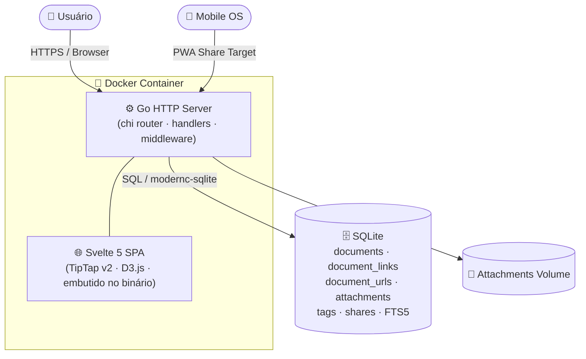

<div align="center">
  
  <h1>PKD — Personal Knowledge Database</h1>
  <p>Base de conhecimento pessoal auto-hospedada, focada em organização, conexões e recuperação rápida de informações.</p>

  <p>
    
    
    
    
    
  </p>
</div>

---

## Funcionalidades

### Conteúdo e edição

| | |
|---|---|
| 📁 **Hierarquia ilimitada** | Documentos dentro de documentos, arrastar e soltar para reorganizar |
| ✏️ **Editor rico** | TipTap v2 — negrito, itálico, títulos, listas, código, citações, imagens inline |
| 📐 **Barra de ferramentas completa** | Tabelas, imagem por URL, alinhamento de parágrafo, destaque de texto com cor personalizável |
| 🔗 **Links bidirecionais** | Relacione documentos pelo painel "Notas relacionadas"; backlinks aparecem automaticamente em "Referenciado por" |
| 📡 **Captura externa** | Envie links de outros apps via PWA share target; Open Graph extraído automaticamente |
| 🔍 **Busca FTS5** | Busca em título, corpo e tags com SQLite Full-Text Search, suporte a snippets |
| 📅 **Calendário** | Navegue pelos documentos pela data de criação |

### Associações por documento

Cada documento possui uma **área de associações** no rodapé, com três colunas:

| Coluna | Funcionalidade |
|---|---|
| 📄 **Notas relacionadas** | Relacione documentos com busca autocomplete; backlinks automáticos |
| 📎 **Arquivos** | Imagens mostram thumbnail; PDFs, áudios e outros tipos exibem ícone. Clicar abre modal de visualização (lightbox, embed PDF, player de áudio/vídeo) |
| 🔗 **Links externos** | URLs com título opcional; verificação de validade no painel de administração |

### Sub-documentos

Quando um documento possui filhos diretos na hierarquia, eles são exibidos como **cards clicáveis** logo abaixo do conteúdo principal, antes da área de associações. Cada card mostra o ícone, o título e um preview do texto (até 160 caracteres). Clicar em um card navega diretamente para o sub-documento.

### Organização e visualização

| | |
|---|---|
| 🏷️ **Hashtags com autocomplete** | Marque documentos com tags; ao digitar, sugeridas as tags já existentes no sistema |
| 🎨 **Cores por tag** | Cada tag possui cor configurável; chips coloridos em toda a interface (sidebar e editor) |
| 🕸️ **Graph View** | Grafo D3.js force-directed: nós de documentos (coloridos pela tag primária) + nós de tags (círculos tracejados). Clicar em tag filtra o grafo |
| 🔗 **Links públicos** | Links de compartilhamento revogáveis, somente leitura |

### Administração

| | |
|---|---|
| 💾 **Backup / Restore** | Download do SQLite + restore com confirmação |
| 🗑️ **Lixeira** | Documentos excluídos ficam em lixeira; restauráveis individualmente ou em lote |
| 🏷️ **Tags** | Renomear, editar cor, excluir ou mesclar tags globalmente; botão para remover tags órfãs |
| 📎 **Arquivos** | Grade com todos os anexos do sistema (thumbnail para imagens), listagem de arquivos órfãos com limpeza em lote |
| 🔗 **Verificação de links** | Testa todos os links externos (HTTP HEAD) e permite excluir os inválidos em lote |
| 🧹 **Limpeza** | Remove anexos órfãos e executa `VACUUM` no banco |

### Interface

| | |
|---|---|
| 🌙 **Tema claro / escuro** | Alternância persistida no `localStorage` |
| 📱 **Responsivo** | Layout mobile-first, alvos de toque ≥ 44 px |
| 📲 **PWA** | Instalável como app; share target no celular; offline somente leitura |
| 🧠 **Favicon** | Ícone personalizado do cérebro em todos os tamanhos (16 → 512 px) |

---

## Início rápido

```bash
mkdir -p /caminho/pkd/db /caminho/pkd/attachments

docker run -d \
  --name pkd \
  --restart unless-stopped \
  -p 8080:8080 \
  -v /caminho/pkd/db:/data/db \
  -v /caminho/pkd/attachments:/data/attachments \
  -e PKD_PASSWORD='SUBSTITUA_POR_UMA_SENHA_FORTE' \
  -e PKD_DB_PATH=/data/db/pkd.sqlite \
  -e PKD_ATTACHMENTS_PATH=/data/attachments \
  ghcr.io/edalcin/pkd:latest
```

Acesse `http://localhost:8080` e digite a senha mestra.

---

## Instalação no UNRAID

Guia completo em português (sem terminal): **[UNRAID.md](UNRAID.md)**

---

## docker compose

```yaml
services:
  pkd:
    image: ghcr.io/edalcin/pkd:latest
    container_name: pkd
    restart: unless-stopped
    ports:
      - "8080:8080"
    environment:
      PKD_PASSWORD: ${PKD_PASSWORD:?PKD_PASSWORD is required}
      PKD_DB_PATH: /data/db/pkd.sqlite
      PKD_ATTACHMENTS_PATH: /data/attachments
    volumes:
      - ./data/db:/data/db
      - ./data/attachments:/data/attachments
    healthcheck:
      test: ["/pkd", "-healthcheck"]
      interval: 30s
      timeout: 3s
      retries: 3
```

```bash
export PKD_PASSWORD='SUBSTITUA_POR_UMA_SENHA_FORTE'
docker compose up -d
```

---

## Variáveis de ambiente

| Variável | Obrigatória | Padrão | Descrição |
|---|---|---|---|
| `PKD_PASSWORD` | **sim** | — | Senha mestra (nunca armazenada, comparada apenas em memória) |
| `PKD_DB_PATH` | **sim** | — | Caminho do arquivo SQLite dentro do container |
| `PKD_ATTACHMENTS_PATH` | **sim** | — | Caminho do diretório de anexos dentro do container |
| `PKD_LISTEN_ADDR` | não | `:8080` | Endereço de escuta HTTP |
| `PKD_SESSION_IDLE_MINUTES` | não | `60` | Minutos de inatividade até expirar a sessão |
| `PKD_MAX_IMAGE_MB` | não | `10` | Tamanho máximo de imagem inline (MB) |
| `PKD_MAX_ATTACHMENT_MB` | não | `100` | Tamanho máximo de arquivo anexado (MB) |
| `PKD_TRUST_PROXY_HEADERS` | não | `0` | Defina como `1` apenas atrás de proxy reverso confiável |
| `PKD_BASE_URL` | não | *(host da request)* | URL pública base para links de compartilhamento (ex: `https://pkd.exemplo.com/`) |

---

## Como usar

### Links bidirecionais

Use o campo **"Buscar nota para relacionar…"** na coluna _Notas relacionadas_ no rodapé do documento para criar relações entre documentos. O documento alvo exibe automaticamente o documento de origem em "Referenciado por", criando um vínculo bidirecional visível nos dois lados.

### Tags e cores

Digite no campo `+ tag` no cabeçalho do documento. Ao digitar, um dropdown sugere as tags já existentes no sistema — selecione ou continue digitando para criar uma nova. Confirme com `Enter` ou `,`.

Para personalizar a cor de uma tag, acesse **Administração → Tags**, clique no seletor de cor ao lado da tag desejada e confirme. A cor propaga imediatamente para os chips de tag na sidebar e no editor.

### Sub-documentos

Crie documentos filhos normalmente pela sidebar (clique direito → "Novo sub-documento"). Ao abrir o documento pai, os filhos diretos aparecem automaticamente como cards logo abaixo do conteúdo, com preview do texto. Clicar em um card navega para o sub-documento.

### Anexos e visualização

Arraste um arquivo ou clique em **"+ Anexar arquivo"**. Imagens exibem thumbnail diretamente; clicar em qualquer anexo abre um modal:

- **Imagem** → lightbox com zoom nativo do browser
- **PDF** → visualizador embutido
- **Áudio** → player HTML5
- **Vídeo** → player HTML5
- **Outros** → tela de download

### Destaque de texto

Na barra de ferramentas do editor, o botão de destaque (🖊) aplica cor de fundo ao texto selecionado. Clique no quadrado de cor ao lado para escolher a cor antes de aplicar. O texto destacado mantém legibilidade tanto no tema claro quanto no escuro.

### Links externos

Na coluna _Links externos_ do rodapé, adicione URLs com título opcional. No painel de **Administração > Links**, teste a validade de todos os links externos cadastrados e exclua os quebrados em lote.

### Graph View

Acesse pelo ícone 🕸️ na barra superior. O grafo mostra:

- **Nós de documento** → círculos coloridos pela tag primária
- **Nós de tag** → círculos com borda tracejada rosa
- **Arestas** → relações entre documentos e entre documentos e suas tags

Por padrão só aparecem documentos com ao menos uma conexão (link ou tag). Marque **"Todos os docs"** para ver o grafo completo. Clicar em um nó de tag filtra o grafo por aquela tag.

---

## Proxy reverso (HTTPS)

O PKD não gerencia TLS — encerre no proxy reverso. Exemplo com **Caddy**:

```caddy
pkd.exemplo.lan {
    reverse_proxy localhost:8080
}
```

Ao usar proxy reverso, adicione `PKD_TRUST_PROXY_HEADERS=1` e configure `PKD_BASE_URL` com a URL pública para que os links de compartilhamento gerem URLs corretas.

---

## Compilar a partir do código-fonte

Requer **Go 1.25+** e **Node.js 22+**.

```bash
git clone https://github.com/edalcin/pkd.git
cd pkd

# 1. Build do frontend Svelte
cd frontend && npm install && npm run build && cd ..

# 2. Rodar localmente
PKD_PASSWORD=devpassword \
PKD_DB_PATH=/tmp/pkd.sqlite \
PKD_ATTACHMENTS_PATH=/tmp/pkd-att \
go run ./cmd/pkd
```

---

## Arquitetura



### Modelo de dados

| Tabela | Descrição |
|---|---|
| `documents` | Documentos com hierarquia via `parent_id`, soft-delete, versionamento otimista |
| `document_links` | Arestas direcionadas entre documentos. Flag `manual` registra links adicionados pelo painel de notas relacionadas |
| `document_urls` | URLs externas com título opcional associadas a documentos |
| `attachments` | Metadados de arquivos; binários em volume externo com path sharding |
| `tags` + `document_tags` | Tags normalizadas com campo `color`; join N:N com documentos |
| `documents_fts` | Tabela virtual FTS5 (contentless) para busca full-text |
| `share_links` | Links públicos com hash de token e campo `revoked_at` |

---

## Documentação

| Documento | Idioma | Descrição |
|---|---|---|
| [UNRAID.md](UNRAID.md) | 🇧🇷 PT-BR | Instalação no UNRAID via GUI |
| [docs/c4/context.md](docs/c4/context.md) | 🇺🇸 EN | C4 Level 1 — Contexto do sistema |
| [docs/c4/container.md](docs/c4/container.md) | 🇺🇸 EN | C4 Level 2 — Containers |
| [docs/c4/component.md](docs/c4/component.md) | 🇺🇸 EN | C4 Level 3 — Componentes Go |
| [docs/c4/code.md](docs/c4/code.md) | 🇺🇸 EN | C4 Level 4 — Structs e fluxos de código |
| [docs/security.md](docs/security.md) | 🇺🇸 EN | Referência de segurança |
| [docs/operations.md](docs/operations.md) | 🇺🇸 EN | Guia de operações e backup |

---

## Licença

MIT © 2026 Eduardo Dalcin
