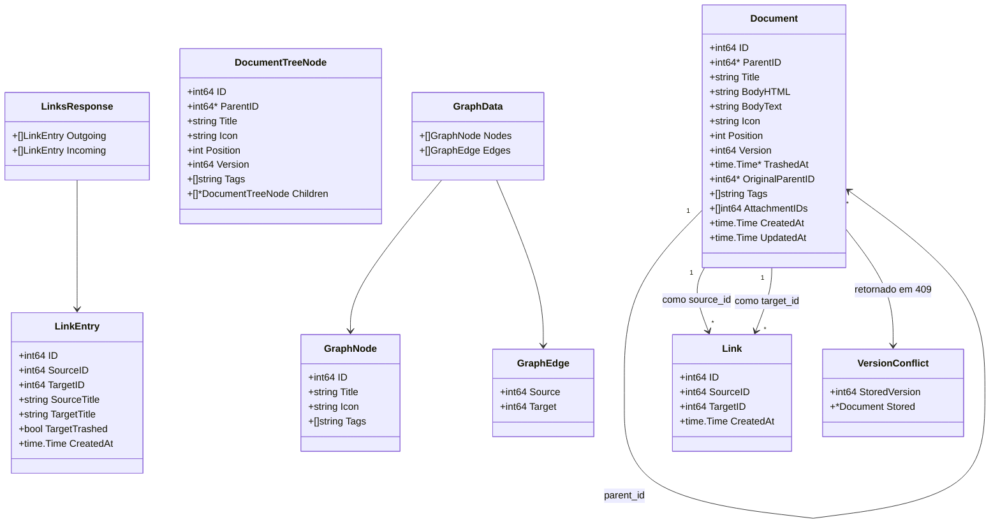
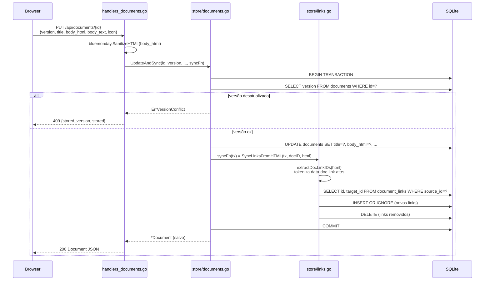
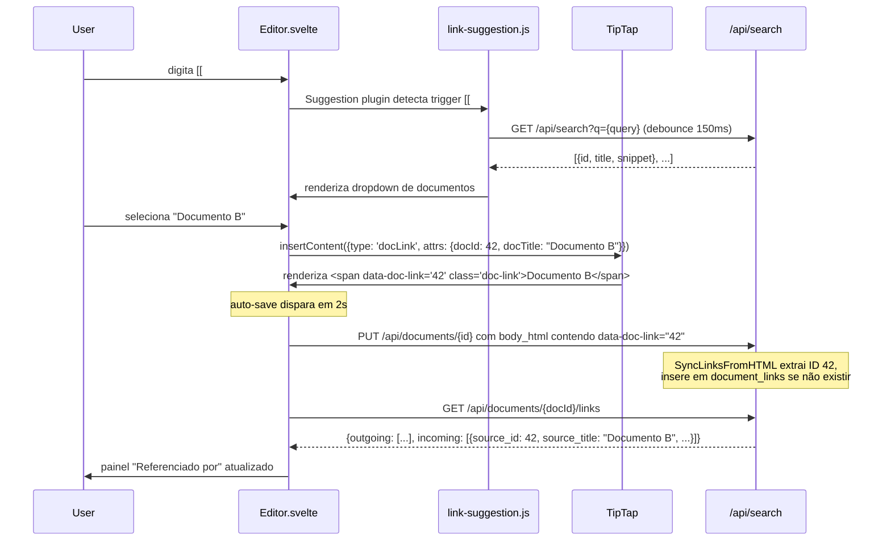
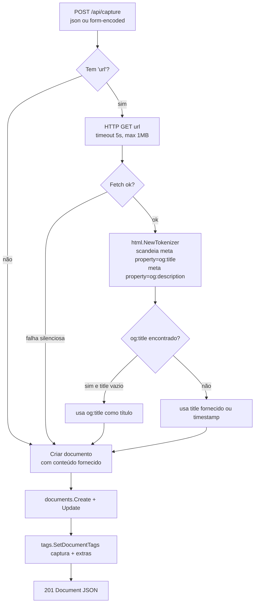
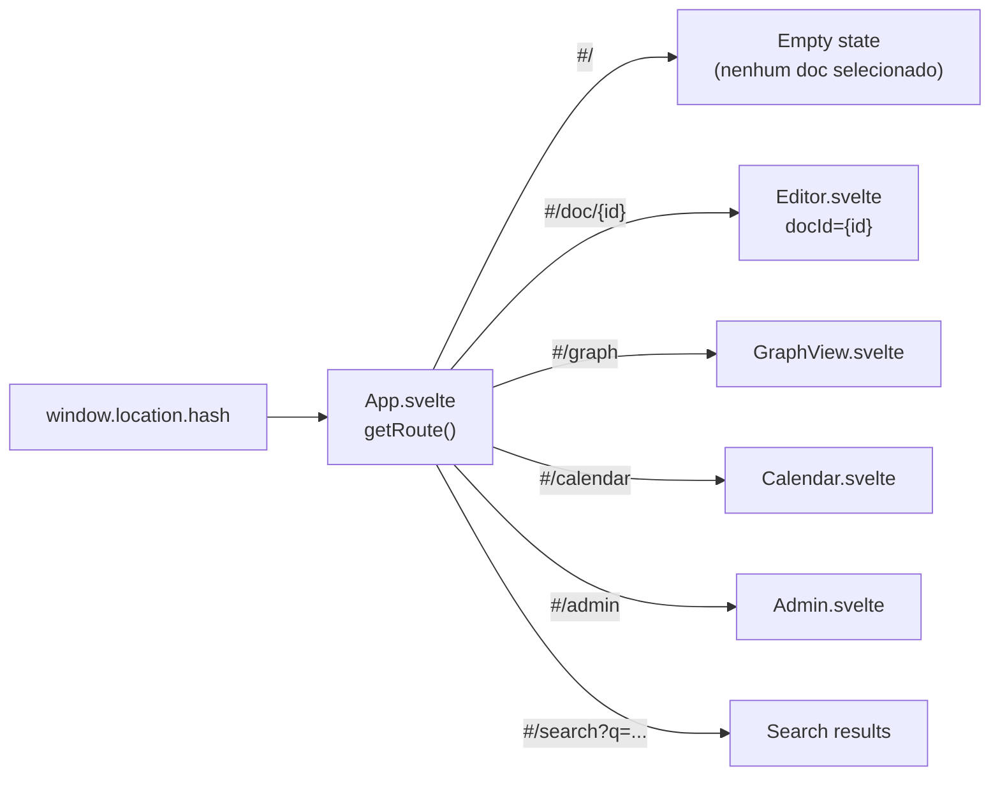

# C4 Level 4 — Code: PKD

> **Versão**: v2 (003-pkm-refactor) · **Data**: 2026-04-16

## Modelo de dados — Structs Go (`internal/model/`)



## Fluxo de sincronização de links (atomicidade)

O link sync ocorre dentro da mesma transação SQL do save do documento, garantindo que o corpo HTML e a tabela `document_links` estejam sempre consistentes.



## Fluxo de criação de link bidirecional no editor



## Extração de Open Graph (captura de conteúdo)



## Schema SQL — tabela document_links (nova em v2)

```sql
CREATE TABLE IF NOT EXISTS document_links (
    id          INTEGER PRIMARY KEY AUTOINCREMENT,
    source_id   INTEGER NOT NULL REFERENCES documents(id) ON DELETE CASCADE,
    target_id   INTEGER NOT NULL REFERENCES documents(id) ON DELETE CASCADE,
    created_at  TEXT    NOT NULL,
    UNIQUE(source_id, target_id)   -- único link de A→B; A→B e B→A são registros independentes
);

CREATE INDEX IF NOT EXISTS idx_document_links_source ON document_links(source_id);
CREATE INDEX IF NOT EXISTS idx_document_links_target ON document_links(target_id);
-- idx_document_links_target viabiliza a query de backlinks:
-- SELECT * FROM document_links WHERE target_id = ? (quem referencia documento X)
```

**Decisões de design:**
- **Sem rótulo ou tipo** — modelo Obsidian/Logseq: simplicidade máxima
- **Backlinks derivados** — `WHERE target_id = X` com índice; sem tabela materializada
- **CASCADE on DELETE** — links removidos automaticamente quando documento é permanentemente excluído
- **Links mantidos no trash** — quando documento vai para lixeira, links permanecem; UI marca como "quebrado"
- **Autorreferência permitida** — A pode linkar para A (uso válido: seções do mesmo documento)

## Roteamento hash-based (frontend)



O servidor Go serve apenas `/` → `index.html`. O fragmento `#...` nunca chega ao servidor — é tratado exclusivamente no cliente. Isso elimina a necessidade de catch-all no backend e permite PWA offline sem service worker complexo.

## Endpoints REST — adições v2

| Método | Caminho | Handler | Descrição |
|---|---|---|---|
| GET | `/api/documents/{id}/links` | `handleListLinks` | `{outgoing: [LinkEntry], incoming: [LinkEntry]}` |
| POST | `/api/documents/{id}/links` | `handleCreateLink` | Body: `{target_id}` → 201 LinkEntry |
| DELETE | `/api/documents/{id}/links/{linkId}` | `handleDeleteLink` | 204 sem corpo |
| GET | `/api/graph` | `handleGraph` | `{nodes: [GraphNode], edges: [GraphEdge]}`. Query: `?tag=&all=true` |
| POST | `/api/capture` | `handleCapture` | JSON ou form-encoded. Cria doc + tag #captura + Open Graph |
