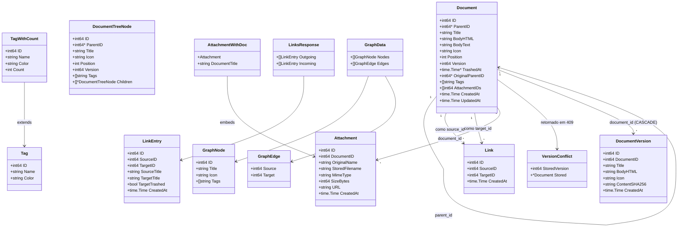
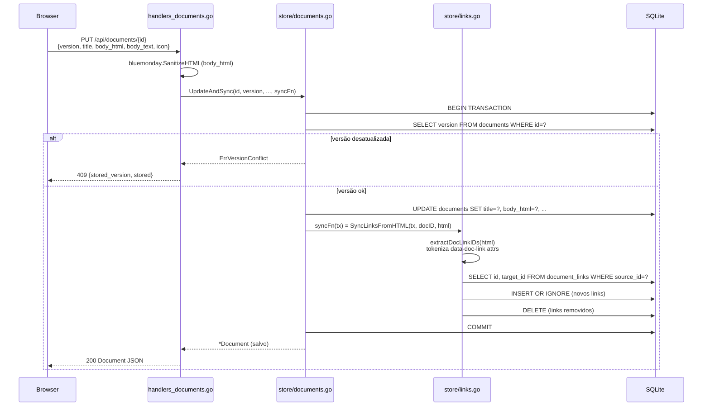
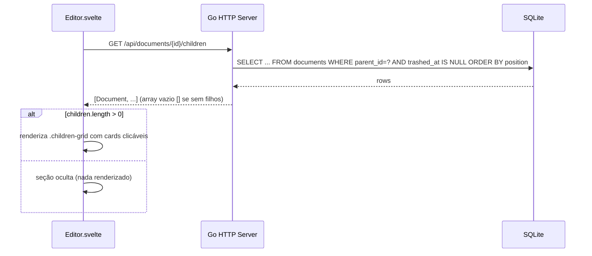
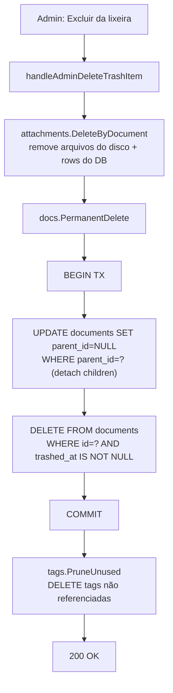
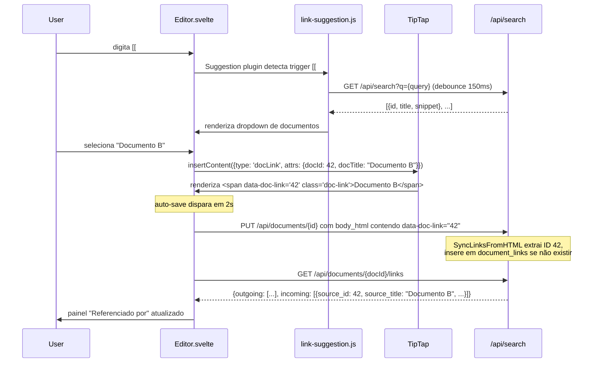
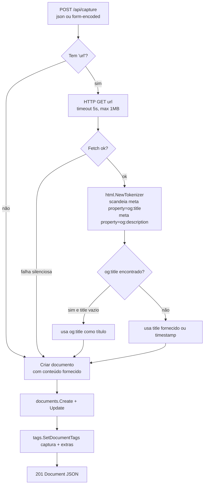
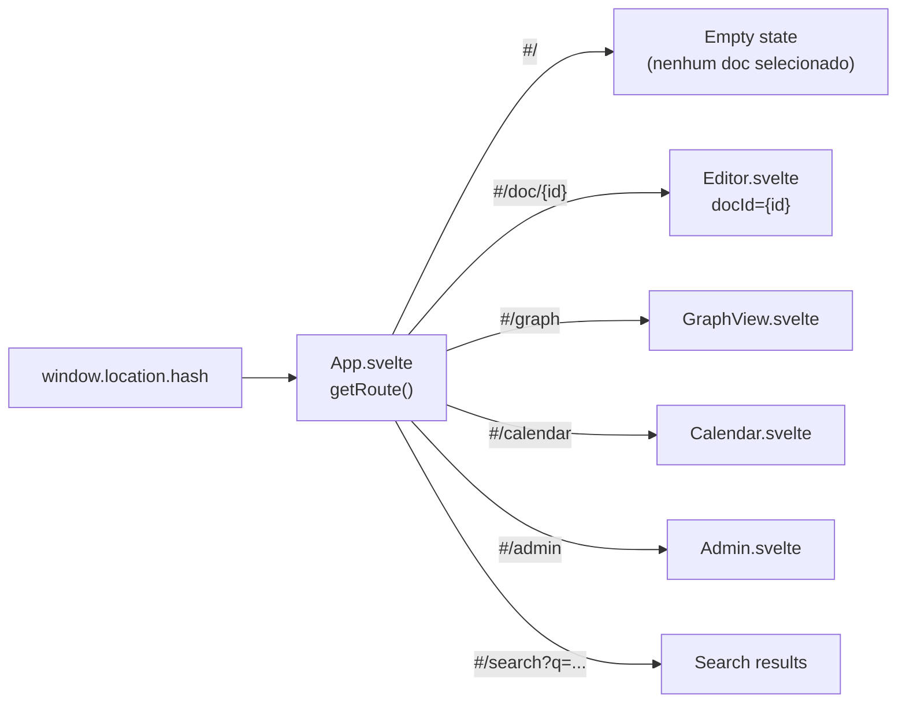

# C4 Level 4 — Code: PKD

> **Versão**: v2.3 · **Data**: 2026-05-29

## Modelo de dados — Structs Go (`internal/model/`)



## Fluxo de sincronização de links (atomicidade)

O link sync ocorre dentro da mesma transação SQL do save do documento, garantindo que o corpo HTML e a tabela `document_links` estejam sempre consistentes.



## Fluxo de carregamento de sub-documentos (cards)

Quando um documento é aberto no editor, filhos diretos são carregados para exibição como cards.



## Fluxo de exclusão permanente com integridade referencial



> **Por que o detach explícito?** SQLite com `PRAGMA foreign_keys=ON` e `ON DELETE RESTRICT` bloqueia o `DELETE` se existirem filhos. Documentos filhos não-lixados devem ser promovidos para root, não excluídos junto com o pai.

## Fluxo de criação de link bidirecional no editor



## Extração de Open Graph (captura de conteúdo)



## Schema SQL — tabela tags (coluna color adicionada)

```sql
CREATE TABLE IF NOT EXISTS tags (
    id    INTEGER PRIMARY KEY AUTOINCREMENT,
    name  TEXT    NOT NULL UNIQUE,
    color TEXT    NOT NULL DEFAULT ''   -- hex color, e.g. '#ef4444'; vazio = cor padrão
);
```

A coluna `color` é adicionada via migração idempotente:

```go
{`ALTER TABLE tags ADD COLUMN color TEXT NOT NULL DEFAULT ''`, "alter tags color"},
```

## Schema SQL — tabela document_links

```sql
CREATE TABLE IF NOT EXISTS document_links (
    id          INTEGER PRIMARY KEY AUTOINCREMENT,
    source_id   INTEGER NOT NULL REFERENCES documents(id) ON DELETE CASCADE,
    target_id   INTEGER NOT NULL REFERENCES documents(id) ON DELETE CASCADE,
    created_at  TEXT    NOT NULL,
    UNIQUE(source_id, target_id)
);

CREATE INDEX IF NOT EXISTS idx_document_links_source ON document_links(source_id);
CREATE INDEX IF NOT EXISTS idx_document_links_target ON document_links(target_id);
```

**Decisões de design:**
- **Sem rótulo ou tipo** — modelo Obsidian/Logseq: simplicidade máxima
- **Backlinks derivados** — `WHERE target_id = X` com índice; sem tabela materializada
- **CASCADE on DELETE** — links removidos automaticamente quando documento é permanentemente excluído
- **Links mantidos no trash** — quando documento vai para lixeira, links permanecem; UI marca como "quebrado"

## Roteamento hash-based (frontend)



O servidor Go serve apenas `/` → `index.html` (com `Cache-Control: no-cache` para garantir que o browser sempre busque o shell mais recente após deploys). O fragmento `#...` nunca chega ao servidor — tratado exclusivamente no cliente.

## Endpoints REST

### Documentos

| Método | Caminho | Handler | Descrição |
|---|---|---|---|
| POST | `/api/documents` | `handleCreateDocument` | Cria documento. Body: `{parent_id?, title}` |
| GET | `/api/documents/{id}` | `handleGetDocument` | Retorna documento com tags e attachment_ids |
| PUT | `/api/documents/{id}` | `handleUpdateDocument` | Salva com versionamento otimista; sincroniza links |
| DELETE | `/api/documents/{id}` | `handleDeleteDocument` | Soft-delete (move para lixeira) |
| POST | `/api/documents/{id}/move` | `handleMoveDocument` | Body: `{new_parent_id}` |
| POST | `/api/documents/{id}/restore` | `handleRestoreDocument` | Restaura da lixeira |
| GET | `/api/documents/{id}/children` | `handleListChildren` | Filhos diretos não-lixados para cards de sub-docs |

### Links bidirecionais

| Método | Caminho | Handler | Descrição |
|---|---|---|---|
| GET | `/api/documents/{id}/links` | `handleListLinks` | `{outgoing: [LinkEntry], incoming: [LinkEntry]}` |
| POST | `/api/documents/{id}/links` | `handleCreateLink` | Body: `{target_id}` → 201 LinkEntry |
| DELETE | `/api/documents/{id}/links/{linkId}` | `handleDeleteLink` | 204 sem corpo |

### Administração

| Método | Caminho | Handler | Descrição |
|---|---|---|---|
| GET | `/api/admin/trash` | `handleAdminListTrash` | Lista todos os documentos na lixeira |
| DELETE | `/api/admin/trash/{id}` | `handleAdminDeleteTrashItem` | Exclui permanentemente (com limpeza de anexos e tags) |
| POST | `/api/admin/trash/empty` | `handleAdminEmptyTrash` | Esvazia lixeira completa |
| GET | `/api/admin/tags` | `handleAdminListAllTags` | Lista todas as tags (LEFT JOIN, inclui count=0) |
| PUT | `/api/admin/tags/{id}` | `handleAdminUpdateTag` | Atualiza nome e/ou cor da tag |
| DELETE | `/api/admin/tags/{id}` | `handleAdminDeleteTag` | Remove tag e suas associações |
| POST | `/api/admin/tags/prune` | `handleAdminPruneTags` | Remove tags sem nenhum documento |
| GET | `/api/admin/attachments` | `handleAdminListAttachments` | Lista todos os anexos com título do documento |
| GET | `/api/admin/attachments/orphans` | `handleAdminListOrphans` | Lista órfãos como `[]OrphanInfo{key, size_bytes}` |
| GET | `/api/admin/attachments/orphans/download` | `handleAdminDownloadOrphan` | Download de arquivo órfão (`?key=`); verifica se é órfão antes de servir |
| DELETE | `/api/admin/attachments/orphans/item` | `handleAdminDeleteOrphan` | Exclui arquivo órfão (`?key=`); verifica se é órfão antes de deletar |
| GET | `/api/documents/{id}/versions` | `handleListVersions` | Lista snapshots sem body_html |
| GET | `/api/documents/{id}/versions/{vid}` | `handleGetVersion` | Snapshot completo com body_html |
| POST | `/api/documents/{id}/versions/{vid}/restore` | `handleRestoreVersion` | Restaura snapshot; retorna Document atualizado |
| DELETE | `/api/documents/{id}/versions/{vid}` | `handleDeleteVersion` | Exclui snapshot individual |
| GET | `/api/admin/settings` | `handleAdminGetSettings` | Lê configurações persistidas (whitelist) |
| PUT | `/api/admin/settings` | `handleAdminPutSettings` | Salva configuração (`versions.max_per_doc`) |
| POST | `/api/admin/backup` | `handleAdminBackup` | Download do SQLite via VACUUM INTO |
| POST | `/api/admin/restore` | `handleAdminRestore` | Restaura backup (requer confirmação) |
| POST | `/api/admin/cleanup` | `handleAdminCleanup` | VACUUM no banco de dados |
| POST | `/api/admin/check-urls` | `handleAdminCheckURLs` | Testa validade de links externos (HTTP HEAD) |

### Outros

| Método | Caminho | Descrição |
|---|---|---|
| GET | `/api/graph` | `{nodes, edges}` para D3.js. Query: `?tag=&all=true` |
| POST | `/api/capture` | Cria doc a partir de URL/texto; extrai Open Graph |
| GET | `/api/tags` | Tags ativas (INNER JOIN — exclui docs na lixeira) |
| GET | `/api/search` | Busca FTS5. Query: `?q=` |
| GET | `/api/documents/{id}/attachments` | Lista anexos do documento |
| POST | `/api/documents/{id}/attachments` | Upload (multipart ou octet-stream) |
| GET | `/api/attachments/{id}` | Serve arquivo com Content-Disposition correto |
| DELETE | `/api/attachments/{id}` | Remove anexo |
