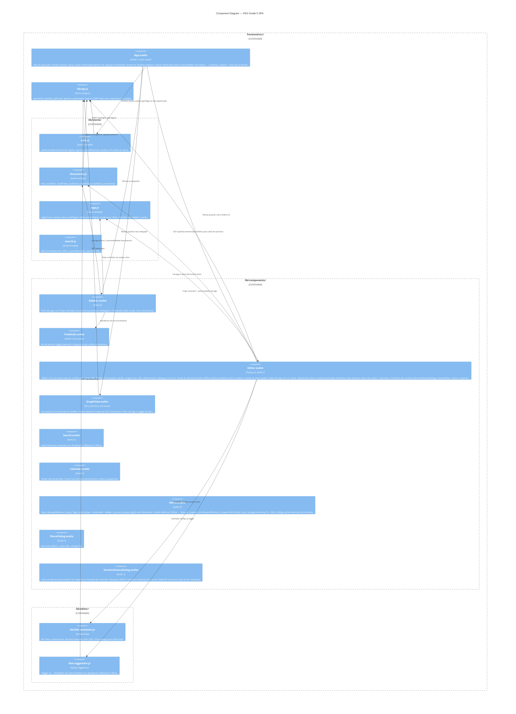

# C4 Level 3 — Component: PKD

> **Versão**: v2.3 · **Data**: 2026-05-29

## Descrição

O backend Go está organizado em pacotes independentes sob `internal/`. O roteador chi conecta todos os componentes. O frontend Svelte é estruturado em stores reativos e componentes.

## Diagrama de Componentes — Backend Go

```mermaid
C4Component
    title Component Diagram — PKD Go Backend

    Container_Boundary(server_pkg, "internal/server") {
        Component(router, "chi Router + Middleware Stack", "go-chi/chi v5", "Monta todas as rotas. Middleware global: RequestID, RealIP, Recoverer, SecurityHeaders, CSRF.")
        Component(auth_mw, "AuthRequired Middleware", "middleware_auth.go", "Exige cookie de sessão válido para rotas protegidas. Retorna 401 sem redirecionar.")
        Component(throttle_mw, "Throttle Middleware", "middleware_throttle.go", "Rate limiting por IP: 5 falhas → bloqueio de 30 min. Responde com Retry-After.")
        Component(security_mw, "SecurityHeaders + CSRF", "middleware_security.go, middleware_csrf.go", "CSP com object-src e frame-src 'self' para embed de PDFs/imagens. HSTS, X-Frame-Options, X-Content-Type-Options. CSRF double-submit cookie.")
        Component(doc_handlers, "Document Handlers", "handlers_documents.go", "CRUD de documentos com versionamento, soft-delete, restore, move hierárquico. handleListChildren retorna filhos diretos para cards de sub-documentos. Chama UpdateAndSync para sincronizar links na mesma transação.")
        Component(link_handlers, "Link Handlers", "handlers_links.go", "GET/POST/DELETE /api/documents/{id}/links. Lista links de saída e backlinks com títulos e status trashed.")
        Component(att_handlers, "Attachment Handlers", "handlers_attachments.go", "Upload, download e delete de anexos. Content-Disposition: inline para PDFs, imagens, áudio, vídeo. Override de X-Frame-Options e CSP para permitir embed no browser.")
        Component(admin_handlers, "Admin Handlers", "handlers_admin.go", "Lixeira (list/delete/empty), backup/restore do DB, VACUUM. Tags: list-all, update (nome+cor), delete, prune-orphans. Attachments: list-all (com doc title), list-orphans (retorna []OrphanInfo com key+size), download-orphan (GET ?key=), delete-orphan (DELETE ?key=). Versions: list, get, restore, delete. Settings: GET/PUT whitelisted keys (versions.max_per_doc).")
        Component(storage_handlers, "Storage Admin Handlers", "handlers_admin_storage.go + _jobs.go + _restore.go", "Configuração de backend, teste de conexão. Operações assíncronas via jobs: migrate-start, reconcile-start (s3|local), cleanup-source-start. Backup assíncrono S3 (backup-start, jobs/{id}, jobs/{id}/download-url) e restauração cross-backend (restore-start). Endpoints legados síncronos mantidos para backup/restore local.")
        Component(jobs_mgr, "BackupJobManager", "jobs.go", "Tracking in-memory de jobs assíncronos (backup/restore/migrate/reconcile/cleanup). sync.Mutex + LRU 50. Single-in-flight por backend (ErrJobInFlight → 409). Job.StorageOp (StorageOpSummary: total_found/succeeded/skipped/errors) para migrate/reconcile/cleanup. RestoreSummary para restore.")
        Component(backup_sweep, "BackupTempSweep", "backup_sweep.go", "Goroutine não-bloqueante no startup. Lista _backup-tmp/ via S3Capable.ListWithMetadata, deleta objetos > 24h via DeleteMany.")
        Component(graph_handler, "Graph Handler", "handlers_graph.go", "GET /api/graph. Retorna nodes + edges para D3.js. Suporta filtro por tag e toggle all-docs.")
        Component(capture_handler, "Capture Handler", "handlers_capture.go", "POST /api/capture. Aceita JSON e form-encoded (PWA share_target). Extrai Open Graph de URLs.")
        Component(other_handlers, "Other Handlers", "handlers_*.go (8 arquivos)", "Tags, busca FTS5, calendário, share links, auth, health, PWA.")
        Component(assets, "Static Assets", "assets.go + web/dist/", "Serve SPA Svelte embutida via //go:embed. index.html com Cache-Control: no-cache para forçar reload após deploys.")
    }

    Container_Boundary(store_pkg, "internal/store") {
        Component(doc_store, "DocumentStore", "documents.go", "Create, GetByID, Update, UpdateAndSync (aceita syncFn(*sql.Tx)), SoftDelete, Restore, Move, ListTree, ListChildren (filhos diretos para cards), PermanentDelete (remove filhos órfãos antes de deletar), EmptyTrash (detach children + delete trashed). SnapshotIfChanged (SHA-256 dedup), ListVersions, GetVersion, RestoreVersion, DeleteVersion.")
        Component(link_store, "LinkStore", "links.go", "CreateLink, DeleteLink, GetLinksForDocument, GetGraphData, SyncLinksFromHTML (tokeniza HTML, diff, insert/delete no mesmo tx).")
        Component(tag_store, "TagStore", "tags.go", "ListWithCounts (INNER JOIN, exclui tags de docs na lixeira), ListAllWithCounts (LEFT JOIN, inclui todas — para admin), SetDocumentTags, RenameOrMerge, Update (nome+cor), Delete, PruneUnused.")
        Component(att_store, "AttachmentStore", "attachments.go", "CreateFile (valida prefixo reservado _backup-tmp/), GetByID, ListByDocument, ListAllWithDocument (join com título do doc), Delete, DeleteByDocument (limpa disco+DB para um doc), ListOrphans, FullPath. EnumerateForBackup, BackfillSHA256, LookupBySHA256 (backup/restore). MigrateToBackend/ReconcileStorageLocations/CleanupSource com callback onProgress(processed,total) e CleanupSource retorna CleanupResult (Total/Deleted/Skipped/Errors) com verificação target.Get antes de apagar.")
        Component(search_store, "SearchStore", "search.go", "FTS5 full-text search com snippets. Índice contentless mantido pela app.")
        Component(share_store, "ShareStore", "shares.go", "Geração de token SHA-256, lookup constant-time, revogação por revoked_at.")
        Component(backup_store, "BackupStore", "backup.go", "VACUUM INTO para backup do DB, restauração atômica.")
        Component(migrate, "Schema Migration", "migrate.go + schema.sql", "DDL idempotente a cada inicialização. Inclui migração de coluna color na tabela tags, content_sha256 nullable e idx_attachments_content_sha256.")
    }

    Container_Boundary(backup_pkg, "internal/backup") {
        Component(manifest, "Manifest", "manifest.go", "Schema v1 do manifest.json: SHA256 + size + MIME + stored_filenames[]. Encode/decode + validação (versão, formato SHA256 hex, stored_filenames não vazio).")
        Component(writer, "StreamingBackup", "writer.go", "Compõe ZIP via archive/zip.Writer. Dedup natural por SHA256. ensureSHA256s computa hashes faltantes via io.TeeReader. Manifest é última entrada. Callback OnProgress.")
        Component(reader, "StreamingRestore", "reader.go", "zip.NewReader(io.ReaderAt) → DecodeManifest → LookupBySHA256 por entrada → fan-out Put por stored_filename. 3 modos on_conflict. Per-entry failure isolation. S3RangeReaderAt adapta S3.GetRange como io.ReaderAt.")
        Component(sweep, "SweepStaleTempObjects", "sweep.go", "Lista prefixo _backup-tmp/, filtra LastModified > maxAge, batch delete via S3Capable.DeleteMany.")
    }

    Container_Boundary(storage_pkg, "internal/storage") {
        Component(storage_iface, "Backend interface + S3Capable", "storage.go", "Backend: Put/Get/Delete/List/Name. S3Capable (opcional): UploadFromReader (multipart), PresignGet, GetRange, HeadSize, ListWithMetadata, DeleteMany.")
        Component(local_backend, "LocalBackend", "local.go", "Filesystem-backed. Implementa Backend + Seeker (range requests para HTTP 206).")
        Component(s3_backend, "S3Backend", "s3.go", "aws-sdk-go-v2/s3. Implementa Backend + S3Capable. Multipart upload via feature/s3/manager. Presign via s3.NewPresignClient. SSE-S3 default.")
    }

    Container_Boundary(security_pkg, "internal/security") {
        Component(sanitize, "HTML Sanitizer", "sanitize.go", "bluemonday AllowList: formatos, imagens, tabelas, links http/https. Remove scripts, event handlers, javascript: URIs.")
        Component(icons, "Icon Validator", "icons.go", "Allowlist de ícones válidos (emojis). Rejeita valores inválidos na API.")
        Component(tokens, "Token Generator", "tokens.go", "crypto/rand para sessões e share tokens. ConstantTimeCompare para password e share lookups.")
        Component(paths, "Path Validator", "paths.go", "Previne path traversal: rejeita .., null bytes, caminhos absolutos; verifica que resultado final está sob base.")
    }

    Container_Boundary(sessions_pkg, "internal/sessions") {
        Component(sess_store, "Session Store", "store.go", "sync.Map em memória: sessionID → {IP, CreatedAt, LastSeenAt}. Não persistido. Expira por idle timeout.")
    }

    Rel(router, auth_mw, "Aplica a rotas autenticadas")
    Rel(router, throttle_mw, "Aplica a /api/login")
    Rel(router, security_mw, "Aplica globalmente")
    Rel(router, doc_handlers, "Roteia /api/documents/*")
    Rel(router, link_handlers, "Roteia /api/documents/{id}/links/*")
    Rel(router, att_handlers, "Roteia /api/attachments/* e /api/documents/{id}/attachments")
    Rel(router, admin_handlers, "Roteia /api/admin/*")
    Rel(router, storage_handlers, "Roteia /api/admin/storage/*")
    Rel(storage_handlers, jobs_mgr, "Start/Get/Finish/SetDownloadURL")
    Rel(storage_handlers, writer, "Dispatch goroutine de backup")
    Rel(storage_handlers, reader, "Dispatch goroutine de restore")
    Rel(storage_handlers, s3_backend, "S3Capable: UploadFromReader, PresignGet, DeleteMany, HeadSize, GetRange")
    Rel(storage_handlers, att_store, "EnumerateForBackup, LookupBySHA256, BackfillSHA256")
    Rel(backup_sweep, s3_backend, "ListWithMetadata + DeleteMany no startup")
    Rel(writer, manifest, "Serializa Manifest como última entrada")
    Rel(reader, manifest, "DecodeManifest")
    Rel(sweep, s3_backend, "ListWithMetadata + DeleteMany")
    Rel(router, graph_handler, "Roteia /api/graph")
    Rel(router, capture_handler, "Roteia /api/capture")
    Rel(router, other_handlers, "Roteia demais endpoints")
    Rel(doc_handlers, doc_store, "CRUD de documentos + ListChildren")
    Rel(doc_handlers, link_store, "SyncLinksFromHTML via UpdateAndSync")
    Rel(link_handlers, link_store, "CRUD de links")
    Rel(graph_handler, link_store, "GetGraphData")
    Rel(capture_handler, doc_store, "Create + Update")
    Rel(capture_handler, tag_store, "SetDocumentTags")
    Rel(admin_handlers, doc_store, "EmptyTrash, PermanentDelete")
    Rel(admin_handlers, att_store, "ListAllWithDocument, ListOrphans, DeleteByDocument")
    Rel(admin_handlers, tag_store, "ListAllWithCounts, Update, Delete, PruneUnused")
    Rel(doc_handlers, sanitize, "Sanitiza HTML antes de salvar")
    Rel(capture_handler, sanitize, "Sanitiza conteúdo capturado")
    Rel(router, sess_store, "Verifica sessão via AuthRequired")

    UpdateLayoutConfig($c4ShapeInRow="3", $c4BoundaryInRow="1")
```

## Diagrama de Componentes — Frontend Svelte

## Tabela de responsabilidades — Backend

| Componente | Arquivo(s) | Funções chave |
|---|---|---|
| DocumentStore | `store/documents.go` | Create, GetByID, Update, **UpdateAndSync**, SoftDelete, Restore, Move, ListTree, **ListChildren**, PermanentDelete (FK-safe), EmptyTrash (FK-safe) |
| LinkStore | `store/links.go` | CreateLink, DeleteLink, GetLinksForDocument, **GetGraphData**, **SyncLinksFromHTML** |
| TagStore | `store/tags.go` | ListWithCounts (INNER JOIN), **ListAllWithCounts** (LEFT JOIN), SetDocumentTags, **Update** (nome+cor), **Delete**, **PruneUnused** |
| AttachmentStore | `store/attachments.go` | CreateFile (rejeita prefixo `_backup-tmp/`), GetByID, ListByDocument, **ListAllWithDocument**, Delete, **DeleteByDocument**, ListOrphans, **EnumerateForBackup**, **BackfillSHA256**, **LookupBySHA256** |
| handlers_documents | `server/handlers_documents.go` | CRUD + **handleListChildren** (`GET /api/documents/{id}/children`) |
| handlers_attachments | `server/handlers_attachments.go` | Upload multipart/octet-stream, **inline Content-Disposition**, override CSP para embed |
| handlers_admin | `server/handlers_admin.go` | Lixeira, VACUUM, **handleAdminListAllTags**, **handleAdminUpdateTag**, **handleAdminDeleteTag**, **handleAdminPruneTags**, **handleAdminListAttachments**, **handleAdminListOrphans** (retorna []OrphanInfo), **handleAdminDownloadOrphan**, **handleAdminDeleteOrphan**. Versões: list/get/restore/delete. Settings: GET/PUT. |
| handlers_admin_storage | `server/handlers_admin_storage.go` + `_jobs.go` + `_restore.go` | Config de backend, teste de conexão. Operações assíncronas: **handleAdminStorageMigrateStart**, **handleAdminStorageReconcileStart** (body `{"backend":"s3"\|"local"}`), **handleAdminStorageCleanupSourceStart**. **handleAdminStorageBackupStart**, **handleAdminStorageGetJob**, **handleAdminStorageRegenerateDownloadURL**, **handleAdminStorageRestoreStart**. Endpoints legados síncronos (`backup-attachments` GET, `restore-attachments` POST) mantidos. |
| BackupJobManager | `server/jobs.go` | Start/Get/Finish/SetDownloadURL. sync.Mutex + LRU 50. Single-in-flight por backend (`ErrJobInFlight` → 409). `Job.StorageOp` (`StorageOpSummary`: total_found/succeeded/skipped/errors) para migrate/reconcile/cleanup. `Job.Restore` (`RestoreSummary`: written/kept/skipped_orphan/hash_mismatch + SkippedEntry[]) para restore. |
| AttachmentStore | `store/attachments.go` | … `MigrateToBackend(ctx, target, onProgress)`, `ReconcileStorageLocations(ctx, src, onProgress)`, `CleanupSource(ctx, source, target, onProgress) CleanupResult` — callbacks de progresso; CleanupSource verifica existência no target antes de deletar. |
| backup pkg | `backup/manifest.go` + `writer.go` + `reader.go` + `sweep.go` | **Manifest** v1 (SHA256 → stored_filenames). **StreamingBackup** (archive/zip + io.TeeReader para backfill SHA256). **StreamingRestore** com 3 modos on_conflict + per-entry failure isolation. **S3RangeReaderAt** wrap GetRange como io.ReaderAt. **SweepStaleTempObjects** no startup. |
| storage.Backend + S3Capable | `storage/storage.go` | Backend: Put/Get/Delete/List/Name. S3Capable opcional: UploadFromReader (multipart via manager.Uploader), PresignGet (TTL 15 min), GetRange (HTTP Range), HeadSize, ListWithMetadata, DeleteMany (batch 1000). |
| handlers_links | `server/handlers_links.go` | GET/POST/DELETE `/api/documents/{id}/links` |
| handlers_graph | `server/handlers_graph.go` | GET `/api/graph?tag=&all=` |
| handlers_capture | `server/handlers_capture.go` | POST `/api/capture` + Open Graph extraction |
