# C4 Level 3 — Component: PKD

> **Versão**: v2 (003-pkm-refactor) · **Data**: 2026-04-16

## Descrição

O backend Go está organizado em pacotes independentes sob `internal/`. O roteador chi conecta todos os componentes. O frontend Svelte é estruturado em stores reativos e componentes.

## Diagrama de Componentes — Backend Go

```mermaid
C4Component
    title Component Diagram — PKD Go Backend

    Container_Boundary(server_pkg, "internal/server") {
        Component(router, "chi Router + Middleware Stack", "go-chi/chi v5", "Monta todas as rotas. Middleware global: RequestID, RealIP, Recoverer, SecurityHeaders, CSRF.")
        Component(auth_mw, "AuthRequired Middleware", "middleware_auth.go", "Exige cookie de sessão válido para rotas protegidas. Retorna 401 sem redirecionar.")
        Component(throttle_mw, "Throttle Middleware", "middleware_throttle.go", "Rate limiting por IP: 5 falhas → bloqueio de 30 min. Responde com Retry-After.")
        Component(security_mw, "SecurityHeaders + CSRF", "middleware_security.go, middleware_csrf.go", "CSP, HSTS, X-Frame-Options, X-Content-Type-Options, Referrer-Policy. CSRF double-submit cookie.")
        Component(doc_handlers, "Document Handlers", "handlers_documents.go", "CRUD de documentos com versionamento, soft-delete, restore, move hierárquico. Chama UpdateAndSync para sincronizar links na mesma transação.")
        Component(link_handlers, "Link Handlers", "handlers_links.go (NEW)", "GET/POST/DELETE /api/documents/{id}/links. Lista links de saída e backlinks com títulos e status trashed.")
        Component(graph_handler, "Graph Handler", "handlers_graph.go (NEW)", "GET /api/graph. Retorna nodes + edges para D3.js. Suporta filtro por tag e toggle all-docs.")
        Component(capture_handler, "Capture Handler", "handlers_capture.go (NEW)", "POST /api/capture. Aceita JSON e form-encoded (PWA share_target). Extrai Open Graph de URLs.")
        Component(other_handlers, "Other Handlers", "handlers_*.go (8 arquivos)", "Tags, busca FTS5, calendário, anexos, share links, admin, auth, health, PWA.")
        Component(assets, "Static Assets", "assets.go + web/dist/", "Serve SPA Svelte embutida via //go:embed. Fallback para web/ legacy se dist/ não compilado.")
    }

    Container_Boundary(store_pkg, "internal/store") {
        Component(doc_store, "DocumentStore", "documents.go", "Create, GetByID, Update, UpdateAndSync (aceita syncFn(*sql.Tx) para atomicidade com links), SoftDelete, Restore, Move, Tree.")
        Component(link_store, "LinkStore", "links.go (NEW)", "CreateLink, DeleteLink, GetLinksForDocument, GetGraphData, SyncLinksFromHTML (tokeniza HTML, diff, insert/delete no mesmo tx).")
        Component(tag_store, "TagStore", "tags.go", "GetAll, SetDocumentTags, RenameOrMerge.")
        Component(search_store, "SearchStore", "search.go", "FTS5 full-text search com snippets. Índice contentless mantido pela app.")
        Component(share_store, "ShareStore", "shares.go", "Geração de token SHA-256, lookup constant-time, revogação por revoked_at.")
        Component(backup_store, "BackupStore", "backup.go", "VACUUM INTO para backup, restauração atômica.")
        Component(migrate, "Schema Migration", "migrate.go + schema.sql", "Aplica DDL idempotente (CREATE TABLE IF NOT EXISTS) a cada inicialização. Sem arquivos de migração versionados.")
    }

    Container_Boundary(security_pkg, "internal/security") {
        Component(sanitize, "HTML Sanitizer", "sanitize.go", "bluemonday AllowList: formatos, imagens, tabelas, links http/https. Remove scripts, event handlers, javascript: URIs.")
        Component(icons, "Icon Validator", "icons.go", "Allowlist de ícones válidos (emojis). Rejeita valores inválidos na API.")
        Component(tokens, "Token Generator", "tokens.go", "crypto/rand para sessões e share tokens. ConstantTimeCompare para password e share lookups.")
        Component(paths, "Path Validator", "paths.go", "Previne path traversal: rejeita .., null bytes, caminhos absolutos; verifica que resultado final está sob base.")
    }

    Container_Boundary(sessions_pkg, "internal/sessions") {
        Component(sess_store, "Session Store", "store.go", "sync.Map em memória: sessionID → {IP, CreatedAt, LastSeenAt}. Não persistido. Expira por idle timeout. Perdido em restart do container.")
    }

    Rel(router, auth_mw, "Aplica a rotas autenticadas")
    Rel(router, throttle_mw, "Aplica a /api/login")
    Rel(router, security_mw, "Aplica globalmente")
    Rel(router, doc_handlers, "Roteia /api/documents/*")
    Rel(router, link_handlers, "Roteia /api/documents/{id}/links/*")
    Rel(router, graph_handler, "Roteia /api/graph")
    Rel(router, capture_handler, "Roteia /api/capture")
    Rel(router, other_handlers, "Roteia demais endpoints")
    Rel(doc_handlers, doc_store, "CRUD de documentos")
    Rel(doc_handlers, link_store, "SyncLinksFromHTML via UpdateAndSync")
    Rel(link_handlers, link_store, "CRUD de links")
    Rel(graph_handler, link_store, "GetGraphData")
    Rel(capture_handler, doc_store, "Create + Update")
    Rel(capture_handler, tag_store, "SetDocumentTags")
    Rel(doc_handlers, sanitize, "Sanitiza HTML antes de salvar")
    Rel(capture_handler, sanitize, "Sanitiza conteúdo capturado")
    Rel(router, sess_store, "Verifica sessão via AuthRequired")

    UpdateLayoutConfig($c4ShapeInRow="3", $c4BoundaryInRow="1")
```

## Diagrama de Componentes — Frontend Svelte

```mermaid
C4Component
    title Component Diagram — PKD Svelte 5 SPA

    Container_Boundary(svelte_app, "frontend/src/") {
        Component(app, "App.svelte", "Svelte 5, hash router", "Raiz da aplicação. Verifica sessão, tema, router hash-based (#/doc/:id, #/graph, #/calendar, #/admin). Monta sidebar + área de conteúdo.")

        Container_Boundary(stores, "lib/stores/") {
            Component(auth_store, "auth.js", "Svelte writable", "authenticated (null|bool), login(), logout(), checkSession(). Lê pkd_csrf cookie via api.js.")
            Component(doc_store_fe, "documents.js", "Svelte writable", "tree, activeDoc, loadTree(), saveDoc(), createDoc(), trashDoc(), moveDoc().")
            Component(tag_store_fe, "tags.js", "Svelte writable", "tags[], loadTags(), setDocumentTags().")
            Component(search_store_fe, "search.js", "Svelte writable", "debouncedSearch() 150ms, searchResults[], clearSearch().")
        }

        Container_Boundary(components_fe, "lib/components/") {
            Component(sidebar, "Sidebar.svelte", "Svelte 5", "Filtro de tags, árvore de documentos delegada a TreeNode.svelte, botão novo documento.")
            Component(tree_node, "TreeNode.svelte", "Svelte 5 (recursivo)", "Nó da árvore: toggle expandir, drag-and-drop, ações contextuais. Usa svelte:self para recursividade.")
            Component(editor, "Editor.svelte", "TipTap v2, svelte-tiptap", "Editor rico com auto-save 2s, conflito de versão 409, upload de imagem via paste/drop, painel de backlinks, lista de anexos, input de tags.")
            Component(graph_view, "GraphView.svelte", "D3.js (d3-force, d3-zoom)", "Simulação force-directed em $effect. Svelte {#each} renderiza SVG circles/lines. Ações D3 zoom e drag via use:. Filtro de tags e toggle all-docs.")
            Component(search_comp, "Search.svelte", "Svelte 5", "Input de busca universal com dropdown de resultados. Debounce 150ms. Enter navega para #/search.")
            Component(calendar, "Calendar.svelte", "Svelte 5", "Grade mensal de dias. Clicar num dia lista documentos criados naquele dia.")
            Component(admin, "Admin.svelte", "Svelte 5", "Abas: Backup/Restore, Lixeira, Tags (rename/merge), Limpeza.")
            Component(share_dialog, "ShareDialog.svelte", "Svelte 5", "Gera link público, copia URL, revoga link.")
        }

        Container_Boundary(editor_exts, "lib/editor/") {
            Component(doclink_ext, "doclink-extension.js", "TipTap Node", "Nó inline customizado. Atributo data-doc-link='{id}'. Click navega para #/doc/{id}. Renderiza como <span class='doc-link'>.")
            Component(link_suggestion, "link-suggestion.js", "TipTap Suggestion", "Trigger: [[ — dropdown de autocomplete via /api/search. Debounce 150ms. Insere nó docLink com {docId, docTitle}.")
        }

        Component(api_js, "lib/api.js", "Fetch wrapper", "apiFetch(), apiGet(), apiPost(), apiPut(), apiDelete(). Lê pkd_csrf cookie e injeta X-CSRF-Token em requisições mutantes.")
    }

    Rel(app, auth_store, "Verifica sessão; exibe LoginPage se não autenticado")
    Rel(app, sidebar, "Monta na esquerda")
    Rel(app, editor, "Monta quando rota é #/doc/:id")
    Rel(app, graph_view, "Monta quando rota é #/graph")
    Rel(sidebar, doc_store_fe, "Carrega árvore, cria/move/deleta documentos")
    Rel(sidebar, tree_node, "Renderiza nós recursivamente")
    Rel(editor, doc_store_fe, "Carrega e salva documento ativo")
    Rel(editor, doclink_ext, "Extensão TipTap: renders links")
    Rel(editor, link_suggestion, "Extensão TipTap: [[ trigger")
    Rel(graph_view, api_js, "GET /api/graph")
    Rel(link_suggestion, api_js, "GET /api/search?q=...")
    Rel(auth_store, api_js, "POST /api/login, /api/logout")
    Rel(doc_store_fe, api_js, "Todos os endpoints /api/documents/*")

    UpdateLayoutConfig($c4ShapeInRow="3", $c4BoundaryInRow="1")
```

## Tabela de responsabilidades — Backend

| Componente | Arquivo(s) | Funções chave |
|---|---|---|
| DocumentStore | `store/documents.go` | Create, GetByID, Update, **UpdateAndSync**, SoftDelete, Restore, Move, Tree |
| **LinkStore** | `store/links.go` (novo) | CreateLink, DeleteLink, GetLinksForDocument, **GetGraphData**, **SyncLinksFromHTML** |
| handlers_links | `server/handlers_links.go` (novo) | GET/POST/DELETE `/api/documents/{id}/links` |
| handlers_graph | `server/handlers_graph.go` (novo) | GET `/api/graph?tag=&all=` |
| handlers_capture | `server/handlers_capture.go` (novo) | POST `/api/capture` + Open Graph extraction |
