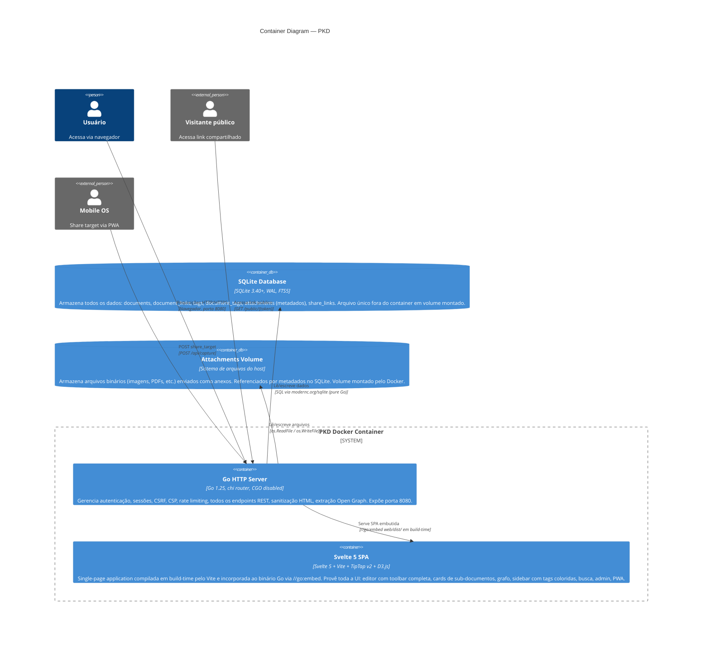
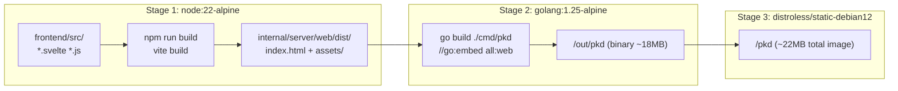

# C4 Level 2 — Container: PKD

> **Versão**: v2.1 · **Data**: 2026-04-18

## Descrição

PKD é entregue como um único container Docker executando um binário Go que incorpora tanto a API REST quanto o frontend Svelte 5 compilado. Dados persistentes ficam em dois volumes Docker externos ao container.

## Diagrama de Containers

## Pipeline de Build

## Responsabilidades dos containers

| Container | Responsabilidade | Tecnologia |
|---|---|---|
| **Go HTTP Server** | Auth, sessões, CSRF, CSP, HSTS, rate limiting, 30+ endpoints REST, sanitização HTML (bluemonday), extração Open Graph (x/net/html), serve SPA embutida com no-cache para index.html | Go 1.25, chi v5, modernc.org/sqlite, bluemonday |
| **Svelte 5 SPA** | Editor TipTap com `[[link]]` autocomplete, toolbar completa (tabela, imagem, alinhamento, destaque), cards de sub-documentos, chips de tag coloridos, Graph View D3.js, sidebar, busca, calendário, admin com gestão de tags/anexos, PWA | Svelte 5, Vite 6, TipTap v2, D3.js (modular) |
| **SQLite Database** | Todos os dados persistentes com ACID, FTS5 para busca full-text, WAL para leituras concorrentes durante backup | SQLite 3.40+, FTS5, WAL, foreign_keys ON |
| **Attachments Volume** | Arquivos binários desacoplados do banco de dados; referenciados por `stored_filename` único na tabela `attachments` | Volume Docker / diretório no host |

## Orçamento de tamanho da imagem (target ≤ 30 MB)

| Componente | Estimativa |
|---|---|
| distroless/static base | ~2 MB |
| Go binary (stripped, no CGO) | ~18 MB |
| Svelte build (TipTap + D3 + app) | ~1.5 MB uncompressed |
| **Total** | **~21.5 MB** |
