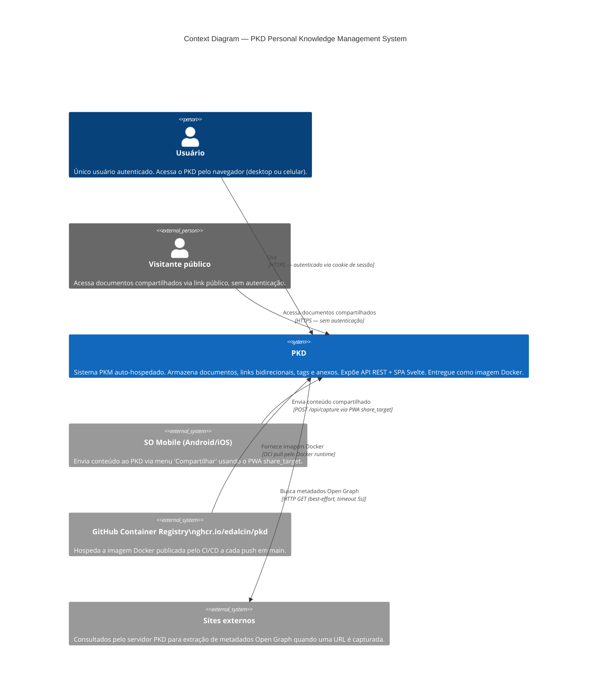

# C4 Level 1 — System Context: PKD

> **Versão**: v2 (003-pkm-refactor) · **Data**: 2026-04-16

## Descrição

PKD (Personal Knowledge Database) é um sistema PKM (Personal Knowledge Management) auto-hospedado de usuário único. O usuário armazena, conecta e recupera conhecimento através de documentos ricos, links bidirecionais e visualização em grafo.

## Diagrama

## Relacionamentos principais

| Relacionamento | Descrição |
|---|---|
| **Usuário → PKD** | Toda interação ocorre via SPA Svelte no navegador, autenticada pela senha mestra |
| **Mobile → PKD** | O SO envia conteúdo (link, texto, imagem) para `/api/capture` via PWA share_target |
| **Visitante → PKD** | Acessa `/public/{token}` — página estática sem JS, CSP restrita |
| **PKD → Sites externos** | Extração de `og:title` e `og:description` para documentos capturados com URL |
| **GHCR → Docker** | CI/CD publica nova imagem a cada push em `main`; sem deploy automático |

## Fora do escopo

- Multi-usuário ou controle de acesso por perfil
- Integração com armazenamento em nuvem (Google Drive, S3, Dropbox)
- Edição colaborativa em tempo real
- Sugestões de conexão via IA/LLM
- Sincronização offline bidirecional
