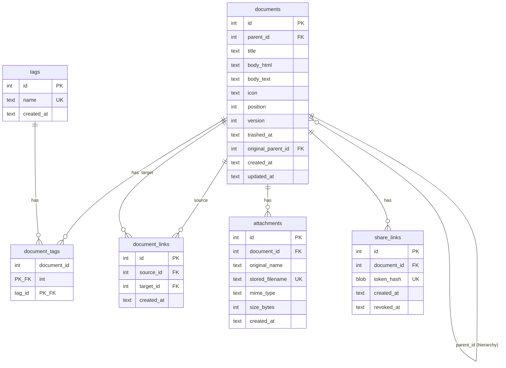

# Data Model: PKM Refactor (003-pkm-refactor)

**Date**: 2026-04-16
**Database**: SQLite 3.40+ via `modernc.org/sqlite` (pure Go, no CGO)
**Evolution**: Extends the schema from `001-personal-knowledge-db` with one new table (`document_links`) and minor column additions.

---

## PRAGMAs (applied at Open, outside transactions)

```sql
PRAGMA foreign_keys = ON;
PRAGMA journal_mode = WAL;
PRAGMA synchronous = NORMAL;
PRAGMA busy_timeout = 5000;
```

---

## Schema DDL

### documents (existing, unchanged)

```sql
CREATE TABLE IF NOT EXISTS documents (
    id                  INTEGER PRIMARY KEY AUTOINCREMENT,
    parent_id           INTEGER REFERENCES documents(id) ON DELETE RESTRICT,
    title               TEXT    NOT NULL DEFAULT 'Untitled',
    body_html           TEXT    NOT NULL DEFAULT '',
    body_text           TEXT    NOT NULL DEFAULT '',
    icon                TEXT,
    position            INTEGER NOT NULL DEFAULT 0,
    version             INTEGER NOT NULL DEFAULT 1,
    trashed_at          TEXT,
    original_parent_id  INTEGER REFERENCES documents(id) ON DELETE SET NULL,
    created_at          TEXT    NOT NULL,
    updated_at          TEXT    NOT NULL
);

CREATE INDEX IF NOT EXISTS idx_documents_parent_id  ON documents(parent_id)  WHERE trashed_at IS NULL;
CREATE INDEX IF NOT EXISTS idx_documents_trashed_at ON documents(trashed_at) WHERE trashed_at IS NOT NULL;
CREATE INDEX IF NOT EXISTS idx_documents_updated_at ON documents(updated_at);
```

### documents_fts (existing, unchanged)

```sql
CREATE VIRTUAL TABLE IF NOT EXISTS documents_fts USING fts5(
    title,
    body_text,
    tags,
    content='',
    tokenize='unicode61 remove_diacritics 2'
);
```

### tags (existing, unchanged)

```sql
CREATE TABLE IF NOT EXISTS tags (
    id         INTEGER PRIMARY KEY AUTOINCREMENT,
    name       TEXT    NOT NULL UNIQUE COLLATE NOCASE,
    created_at TEXT    NOT NULL
);
```

### document_tags (existing, unchanged)

```sql
CREATE TABLE IF NOT EXISTS document_tags (
    document_id INTEGER NOT NULL REFERENCES documents(id) ON DELETE CASCADE,
    tag_id      INTEGER NOT NULL REFERENCES tags(id)      ON DELETE CASCADE,
    PRIMARY KEY (document_id, tag_id)
);
CREATE INDEX IF NOT EXISTS idx_document_tags_tag_id ON document_tags(tag_id);
```

### document_links (NEW — bidirectional links)

```sql
CREATE TABLE IF NOT EXISTS document_links (
    id          INTEGER PRIMARY KEY AUTOINCREMENT,
    source_id   INTEGER NOT NULL REFERENCES documents(id) ON DELETE CASCADE,
    target_id   INTEGER NOT NULL REFERENCES documents(id) ON DELETE CASCADE,
    created_at  TEXT    NOT NULL,
    UNIQUE(source_id, target_id)
);

CREATE INDEX IF NOT EXISTS idx_document_links_source ON document_links(source_id);
CREATE INDEX IF NOT EXISTS idx_document_links_target ON document_links(target_id);
```

**Design notes**:
- **Simple link model** (Q6): No label, no type. Just source → target.
- **UNIQUE constraint**: Only one link from A→B. A→B and B→A are independent records.
- **Backlinks are derived**: To find "who references document X", query `WHERE target_id = X`. No materialized backlink column — the index on `target_id` makes this fast.
- **CASCADE on DELETE**: When a document is permanently deleted, all its links (as source or target) are removed. When soft-deleted (trashed), links remain — the UI shows them as "broken" if the target is trashed.
- **No self-link prevention at DB level**: A document CAN link to itself (valid use case per edge cases). The UI may warn but won't block.

### attachments (existing, unchanged)

```sql
CREATE TABLE IF NOT EXISTS attachments (
    id               INTEGER PRIMARY KEY AUTOINCREMENT,
    document_id      INTEGER NOT NULL REFERENCES documents(id) ON DELETE RESTRICT,
    original_name    TEXT    NOT NULL,
    stored_filename  TEXT    NOT NULL UNIQUE,
    mime_type        TEXT    NOT NULL DEFAULT 'application/octet-stream',
    size_bytes       INTEGER NOT NULL DEFAULT 0,
    created_at       TEXT    NOT NULL
);
CREATE INDEX IF NOT EXISTS idx_attachments_document_id ON attachments(document_id);
```

### share_links (existing, unchanged)

```sql
CREATE TABLE IF NOT EXISTS share_links (
    id          INTEGER PRIMARY KEY AUTOINCREMENT,
    document_id INTEGER NOT NULL REFERENCES documents(id) ON DELETE CASCADE,
    token_hash  BLOB    NOT NULL UNIQUE,
    created_at  TEXT    NOT NULL,
    revoked_at  TEXT
);
CREATE INDEX IF NOT EXISTS idx_share_links_document_id ON share_links(document_id);
CREATE INDEX IF NOT EXISTS idx_share_links_token_hash  ON share_links(token_hash);
```

---

## Entity Relationship Diagram (Mermaid)



---

## State Transitions

### Document Lifecycle

```
[created] → active → trashed → permanently_deleted
                  ↑           |
                  +-----------+
                    (restore)
```

- **active**: `trashed_at IS NULL`. Visible in tree, searchable, linkable.
- **trashed**: `trashed_at IS NOT NULL`. Hidden from tree and search. Links TO this doc show as "broken". Links FROM this doc still exist but the doc is not visible.
- **permanently_deleted**: Row deleted via `DELETE FROM documents WHERE id = ?`. CASCADE removes document_tags, document_links (source and target), share_links. Attachments require explicit cleanup.

### Link Lifecycle

```
[created] → active → (document deleted) → cascade_removed
```

- Links have no independent lifecycle — they exist as long as both documents exist.
- When a target document is **trashed** (not deleted), the link remains in the DB but the UI marks it as "broken".
- When a document is **permanently deleted**, CASCADE removes all links where it is source or target.

### Share Link Lifecycle

```
[created] → active → revoked
```

- Same as 001 spec. `revoked_at` is set on revoke. Never reactivated.

---

## In-Memory Entities (not persisted)

### Session
- `ID` (string, 32 random bytes base64url)
- `IP` (string)
- `CreatedAt` (time.Time)
- `LastSeenAt` (time.Time)

### ThrottleState (per-IP)
- `Failures` (int)
- `LockedAt` (time.Time)

---

## New API Endpoints (links + graph + capture)

### Links
- `GET /api/documents/{id}/links` → list outgoing links + incoming backlinks
- `POST /api/documents/{id}/links` → create link `{target_id}`
- `DELETE /api/documents/{id}/links/{linkId}` → remove link

### Graph
- `GET /api/graph` → all connected documents as `{nodes: [{id, title, icon, tags}], edges: [{source, target}]}`
- `GET /api/graph?tag=foo` → filtered by tag

### Capture
- `POST /api/capture` → create document from external content `{title, content, url, tags[]}`

---

## Cross-Reference: Spec → Schema

| Requirement | Schema element |
|---|---|
| FR-001 (CRUD) | `documents` table |
| FR-002 (title, body, icon, tags) | `documents.title`, `.body_html`, `.icon` + `document_tags` |
| FR-003 (hierarchy) | `documents.parent_id` |
| FR-004 (trash) | `documents.trashed_at`, `.original_parent_id` |
| FR-006 (version) | `documents.version` |
| FR-010 (links) | `document_links` table |
| FR-011 (backlinks) | `idx_document_links_target` index (reverse query) |
| FR-014 (autocompletion) | `documents` table query (title LIKE) |
| FR-030 (tags) | `tags` + `document_tags` |
| FR-031 (search) | `documents_fts` FTS5 virtual table |
| FR-040 (capture) | `POST /api/capture` → `documents` insert + tag |
| FR-050 (share) | `share_links` table |
